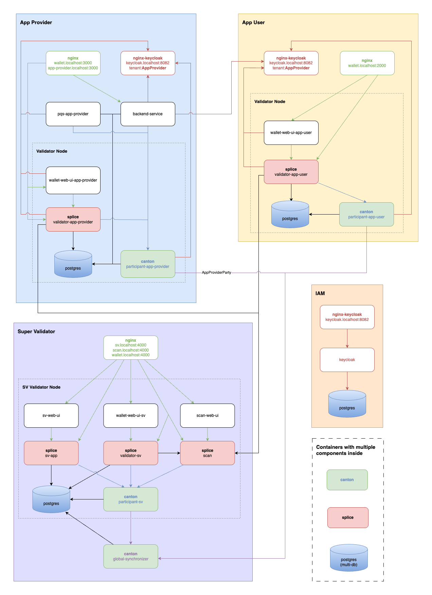

# Canton Network application quickstart

This project provides scaffolding to develop a Canton Network application for the Global Synchronizer (CN GS). We intend that you clone the repository and incrementally update the solution to match your business operations. We assume that you have a Daml Enterprise license to leverage all of this project's features at runtime. However, an OSS developer can benefit from this project by understanding how a CN GS application is structured.
 
To run the Quickstart you need some binaries from Artifactory.  Request Artifactory access by clicking [here](https://www2.digitalasset.com/contact-us-access-to-jfrog) and we will get right back to you.  

The terms and conditions for the binaries can be found [here](https://github.com/digital-asset/cn-quickstart/blob/main/terms.md). 

The is licensed under the BSD Zero Clause License.

## Disclaimer

Once you are familiar with the QS, please review the technology choices and the application design to determine what changes are needed. Technology and design decisions are ultimately up to you. Please be aware that the CN QS is a rapidly evolving work in progress. 

## Docs and guides

You can find Quickstart documentation in the Canton Network documentation portal.
- [Quickstart Installation](https://docs.digitalasset.com/build/3.3/quickstart/download/cnqs-installation)
- [Exploring The Demo](https://docs.digitalasset.com/build/3.3/quickstart/operate/explore-the-demo)
- [Project Structure](https://docs.digitalasset.com/build/3.3/quickstart/configure/project-structure-overview)
- [FAQ](https://docs.digitalasset.com/build/3.3/quickstart/troubleshoot/cnqs-faq.html)
- [Observability and Troubleshooting Overview](https://docs.digitalasset.com/build/3.3/quickstart/observe/observability-troubleshooting-overview.html)

### Technical documentation

- [Observability](sdk/docs/user/001-observability.md)
- [Topology](sdk/docs/user/002-topology.md)

This project is rapidly enhanced, so please check back often for updates.

## Setup

This repository uses `direnv`, `nix`, and `docker-compose` to provide development dependencies:

* how to [install direnv](https://direnv.net/docs/installation.html)
* how to [install nix](https://nix.dev/install-nix.html)
* how to [install docker-compose](https://docs.docker.com/compose/install/) 

**Important (MacOS only):** Run the following command to download and install the Daml SDK with the correct version:
```sh
cd quickstart
make install-daml-sdk
```

Project files are located in the `quickstart` directory. You can use the `quickstart` directory as a standalone project without nix, but you will need to provide binary dependencies manually.

### Artifactory access

As mentioned, Some Docker images are from Digital Asset's [artifactory](https://digitalasset.jfrog.io). To access these artifacts the build system in this repository uses a `~/.netrc` file. You can get (or create) the necessary credentials on your [user profile](https://digitalasset.jfrog.io/ui/user_profile) page. The `.netrc` file should contain the following:

```sh
machine digitalasset.jfrog.io
login <username>
password <identity_token>
```

**Additionally,** to pull licensed docker images you must also log into the following Docker registries:

```bash
docker login -u <username> -p <password> digitalasset-docker.jfrog.io
```

Use the same username and password from your Artifactory credentials.

## Quickstart

To start the application:

```bash
# In the local repository directory
$ direnv allow
$ cd quickstart

# Setup your quickstart environment
$ make setup

# Build the application
$ make build

# Start the application, Canton services, and Observability (if enabled)
$ make start

# In a separate shell - run a Canton Console for the App Provider
$ make console-app-provider

# In a separate shell - run Daml Shell
$ make shell
```

If a container fails to start, there are a few things to try:

- Ensure Docker Compose is configured to allocate enough memory. The recommended minimum total memory is 8 GB.
- Start fresh with `make clean-all` and then delete all Docker images and volumes.  
- You may need to upgrade to a more recent version of the Daml SDK. Run `make install-daml-sdk` to assess your version and upgrade if you're not on the latest version.

When running `make start` for the first time, an assistant will help you setting up the local deployment. You can choose to run the application in `DevNet` or `LocalNet` mode (recommended) for local development and testing, the latter meaning that a transient Super Validator is set up locally. You can change this later by running `make setup`.

In `DevNet` mode, you can configure a non-default `SPONSOR_SV_ADDRESS`, `SCAN_ADDRESS` and `ONBOARDING_SECRET_URL` or `ONBOARDING_SECRET` in the `quickstart/.env` file.

**Note**: Access to the Super Validator endpoints on DevNet may require a VPN setup.

**Note**: The CN QS uses Java SDK version `Eclipse Temurin JDK version 17.0.12+7`.
The Java SDK runs within the Docker container.
This information is specified in `quickstart/compose.yaml` and `.env`.

## Available make targets

Run `make help` to see a list of all available targets, including (but not limited to):

- **start**: Builds and starts the application, including frontend and backend services, using Docker Compose. Also starts `observability` and/or `LocalNet` stack depending on configuration.
- **setup**: Configure the local development environment (enable DevNet/LocalNet, Observability)
- **stop**: Stops the application services, as well as the observability stack.
- **stop-application**: Like `stop`, but leaves the observability services running.
- **restart**: Re-runs the application services by stopping and then starting it again.
- **build**: Builds frontend, Daml model, and backend.
- **console-app-provider**: Starts the Canton console using Docker, connected to the running app provider ledger.
- **console-app-user**: Starts the Canton console using Docker, connected to the running app user ledger.
- **shell**: Starts Daml Shell using Docker, connected to the running application PQS database.
- **status**: Shows the status of Docker containers.
- **logs**: Shows logs of Docker containers.
- **tail**: Tails logs of Docker containers in real-time.
- **clean**: Cleans the build artifacts.
- **clean-docker**: Stops and removes Docker containers and volumes.
- **clean-application**: Like `clean-docker`, but leaves the observability services.
- **clean-all**: Stops and removes all Docker containers and volumes, including observability services.

## Topology

This diagram summarizes the relationship of services that are started as part of `make start`. The `canton` and `splice` services are configured to serve multiple logically separate components (each component represented with a box in the diagram) from a single container to reduce resource consumption. Similarly the `postgres` service contains multiple databases required by QS services. One `nginx` service is used as proxy for all QS services that needs one except for `keycloak` that has its own `nginx-keycloak` as it needs to be ready before other services start. The focus of `Canton Network Quickstart` is to provide a development environment for App Providers.



For more information and detailed diagrams, please refer to the [Topology](sdk/docs/user/002-topology.md) documentation.

## Accessing frontends

After starting the application with `make start` you can access the following UIs:

### Application UIs

- **Application user frontend**
  - **URL**: [http://app-provider.localhost:3000](http://app-provider.localhost:3000)
  - **Description**: The main web interface of the application.

- **App user wallet UI**
  - **URL**: [http://wallet.localhost:2000](http://wallet.localhost:2000)
  - **Description**: Interface for managing user wallets.

- **App provider wallet UI**
  - **URL**: [http://wallet.localhost:3000](http://wallet.localhost:3000)
  - **Description**: Interface for managing user wallets.

### Super Validator UIs (if LocalNet enabled via `make setup`)

> **Note**: These interfaces are only accessible when starting in **LocalNet** mode. Run `make setup` to switch between `LocalNet` and `DevNet`.

- **Super Validator web UI**
  - **URL**: [http://sv.localhost:4000](http://sv.localhost:4000)
  - **Description**: Interface for super validator functionalities.

- **Scan Web UI**
  - **URL**: [http://scan.localhost:4000](http://scan.localhost:4000)
  - **Description**: Interface to monitor transactions.

  > **Note**: `LocalNet` rounds may take up to 6 rounds (equivalent to one hour) to display in the scan UI.

All the Super Validator UIs are accessible via a gateway at [http://localhost:4000](http://localhost:4000).

The `*.localhost` domains will resolve to your local host IP `127.0.0.1`.

### Auth

To perform operations such as creating, editing, and archiving assets, users must be authenticated and authorized. The endpoints that perform these operations are protected by OAuth2 Authorization Code Grant Flow. GRPC communication between the backend service and participant is secured by OAuth2 Client Credentials Flow.

### Port mappings

The LocalNet configuration includes port mappings for local development that should not be exposed in production deployments.
See the [Project structure](sdk/docs/guide/ProjectStructureGuide-20250317.pdf) for more details.

## License

**You may use the contents of this repository in parts or in whole according to the `0BSD` license.**

Copyright &copy; 2025 Digital Asset (Switzerland) GmbH and/or its affiliates

> Permission to use, copy, modify, and/or distribute this software for
> any purpose with or without fee is hereby granted.
> 
> THE SOFTWARE IS PROVIDED “AS IS” AND THE AUTHOR DISCLAIMS ALL
> WARRANTIES WITH REGARD TO THIS SOFTWARE INCLUDING ALL IMPLIED WARRANTIES
> OF MERCHANTABILITY AND FITNESS. IN NO EVENT SHALL THE AUTHOR BE LIABLE
> FOR ANY SPECIAL, DIRECT, INDIRECT, OR CONSEQUENTIAL DAMAGES OR ANY
> DAMAGES WHATSOEVER RESULTING FROM LOSS OF USE, DATA OR PROFITS, WHETHER IN
> AN ACTION OF CONTRACT, NEGLIGENCE OR OTHER TORTIOUS ACTION, ARISING OUT
> OF OR IN CONNECTION WITH THE USE OR PERFORMANCE OF THIS SOFTWARE.
