==================
Exploring the demo 
==================
---------------------------------------
Canton Network Quickstart guide \| 2025
---------------------------------------

**Contents**

`Exploring the demo <#exploring-the-demo>`__

`Prerequisites <#prerequisites>`__

`Walkthrough <#walkthrough>`__

   `Canton Console <#canton-console>`__

   `Daml Shell <#daml-shell>`__

   `Connect to DevNet <#connect-to-devnet>`__

   `Important: migration ID for DevNet connections <#important-migration-id-for-devnet-connections>`__

   `Configuring non-default DevNet sponsors <#configuring-non-default-devnet-sponsors>`__

   `SV UIs <#sv-uis>`__

   `Canton Coin Scan <#canton-coin-scan>`__

   `Observability dashboard <#observability-dashboard>`__

`Next Steps <#next-steps>`__

Exploring the Demo
==================

The CN QS and its guides are a work-in-progress (WIP). 
As a result, the CN QS guides may not be a little out of step with the application. 
If you find errors or other inconsistencies, please contact your representative at Digital Asset.

This section works through a complete business operation within the CN QS.

Prerequisites
=============

You should have successfully `installed the CN QS <https://github.com/digital-asset/cn-quickstart/blob/main/docs/guide/CN-QS-Installation-20250314.pdf>`__
before beginning this demonstration.

Access to the `CN-Quickstart Github repository <https://github.com/digital-asset/cn-quickstart>`__ and `CN Docker repository <https://digitalasset.jfrog.io/ui/native/canton-network-docker>`__
is needed to successfully pull the Digital Asset artifacts from JFrog Artifactory.

Access to the *Daml-VPN* connection or `a SV Node <https://docs.dev.sync.global/validator_operator/validator_onboarding.html>`__
that is whitelisted on the CN is required to connect to DevNet. 
The GSF publishes a `list of SV nodes <https://sync.global/sv-network/>`__ who have the ability to sponsor a Validator node. 
To access DevNet, contact your sponsoring SV agent for VPN connection information.

If you need support accessing the SV or VPN email support@digitalasset.com.

The CN QS is a Dockerized application and requires `Docker Desktop <https://www.docker.com/products/docker-desktop/>`__. 
It is recommended to allocate 8 GB of memory and 3 GB of Swap memory to properly run the required Docker containers. 
If you witness unhealthy containers, please consider allocating additional resources, if possible.

DevNet is less intensive because the SVs and other LocalNet containers are hosted outside of your local machine.

Walkthrough
===========

After the QS is installed and running, confirm that you are in the quickstart subdirectory of the CN QS.

Open an incognito browser.

Navigate to:

localhost:3000/login

   💡 Currently, localhost URLs do not work in Safari. We are working on a solution and apologize for the inconvenience.

Alternatively, in the terminal, from quickstart/ run:

make open-app-ui

.. image:: images/demo_images/01-logincnqs.png

Make note that the AppProvider’s username is “pat” and the password is “abc123” (all lowercase).

Login as the AppProvider.

Fill in the login credentials: username: pat, password: abc123

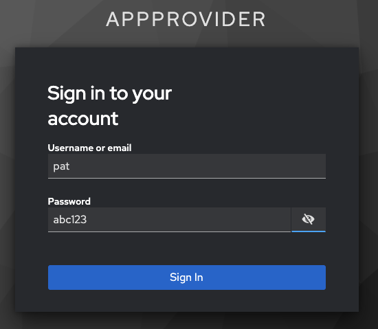

Select “AppInstalls” in the menu.

.. image:: images/demo_images/02a-app-installs-view.png

Open a terminal.

From /quickstart/ run:

`make create-app-install-request`

This command creates an App Installation Request on behalf of the Participant.

.. image:: images/demo_images/04-create-install-req.png

   If your machine is not powerful enough to host LocalNet or if the docker containers are not responsive then the response may show a failure with status code 404 or 000. Increasing Docker memory limit to at least 8 GB should allow the LocalNet containers to operate properly.

.. image:: images/demo_images/05-error-app-install.png

Return to the browser.

The install request appears in the list.

Click “Accept”.

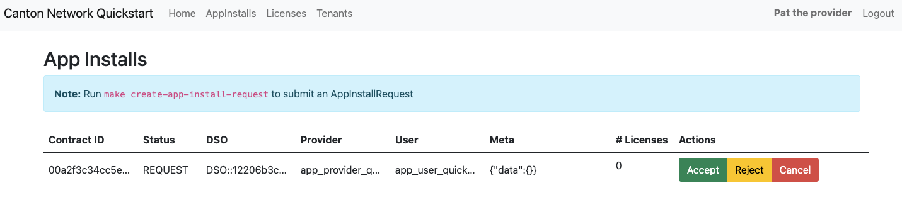

The AppInstallRequest is Accepted. The actions update to create or cancel the license.

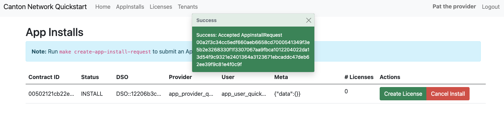

Click “Create License”.

The license is created and the “# Licenses” field is updated.

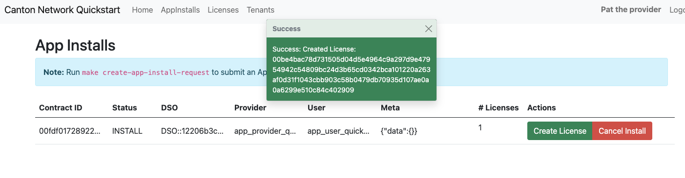

In the AppProvider, “Pat the provider’s,” account, navigate to the **Licenses** menu and select “Actions.”

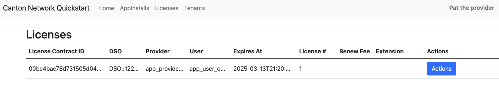

An “Actions for License” modal opens with an option to renew or expire the license. 
Per the Daml contract, licenses are created in an expired state. 
To activate the license, it must be renewed.

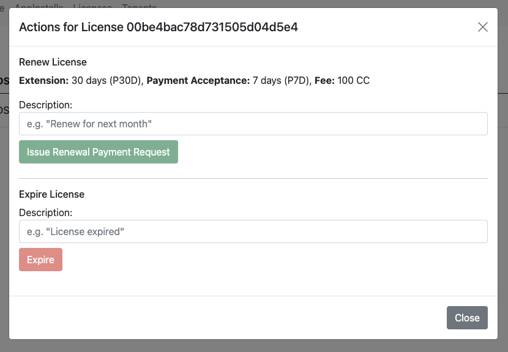

To renew the license, enter a description then click the green “Issue Renewal Payment Request” button.

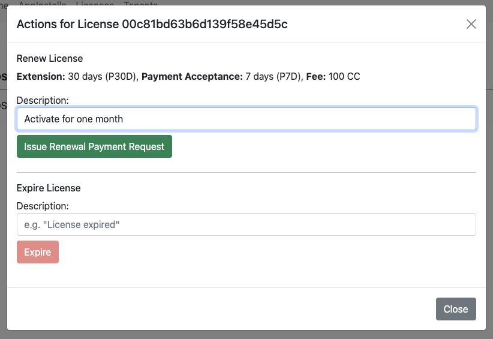

The license renewal process is initiated and ultimately successful.

.. image:: images/demo_images/12-init-renewal.png

The license is now available for a 30-day extension for a flat fee of $100 CC.

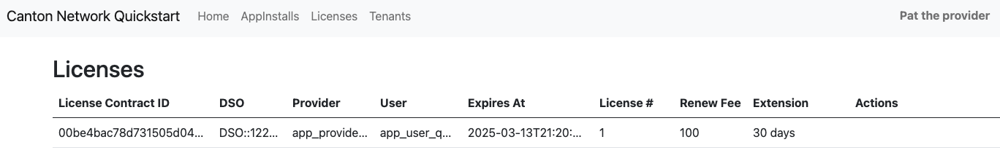

.

Pat the provider has done as much as they are able until Alice pays the renewal fee.

   💡For the next step we recommend opening a separate browser in incognito mode. 
   Each user, AppProvider, and Org1, should be logged into separate browsers for most consistent results. 
   For example, if you logged into AppProvider using Chrome, you would use Firefox when logging into Org1.

Navigate to http://localhost:3000/login using a separate browser in incognito or private mode.

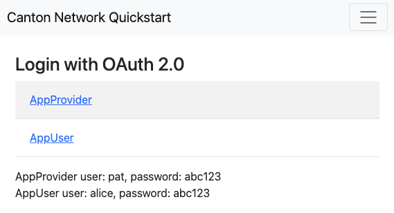

Login as AppUser alice.

Note that AppUser’s username is “alice” and the password is “abc123”.

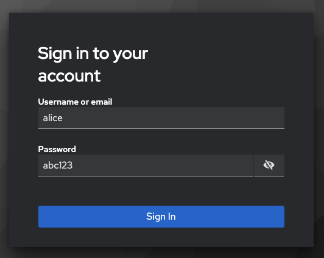

Go to the **Licenses** View and click the “Pay renewal” button.

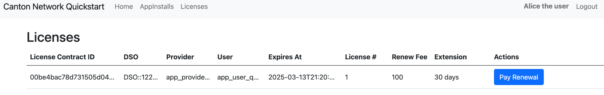

Click on the Pay Renewal button. This navigates to the Canton Coin Wallet log in. Click “LOG IN WITH OAUTH2”.

💡 If you have any issues with log in, navigate directly to http://wallet.localhost:2000/.

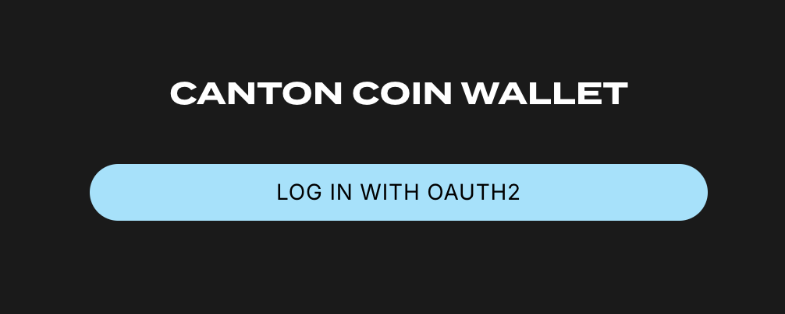

This navigates to a keycloak login.

Enter the same username and password as before.

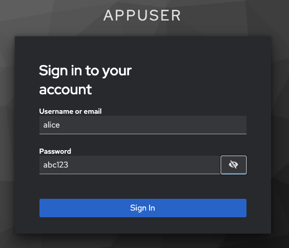

Signing in directs to the Canton Coin Wallet.

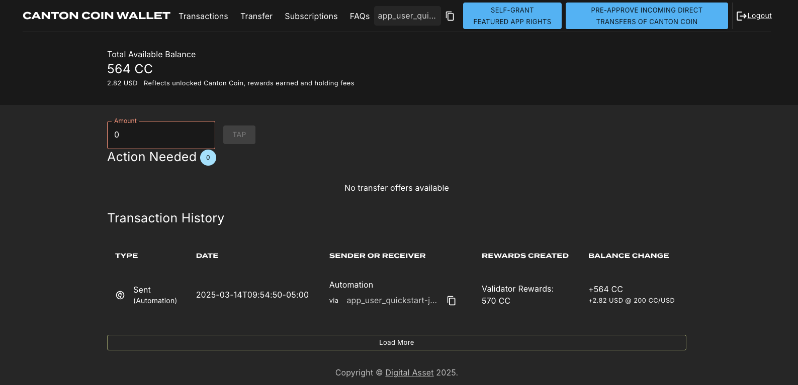

The wallet must be populated with CC in order to fulfill the
transaction.

In CC Wallet, populate the wallet with $100 USD, or the equivalent of
20,000 CC.

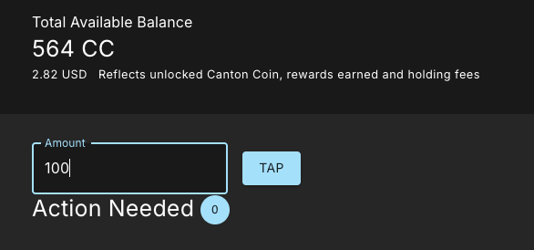

The wallet was prepopulated with 564 CC so it now contains 20,564 CC.

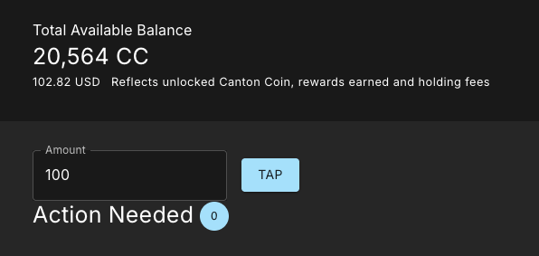

Return to the License Renewal Request as Org1. Click “Pay Renewal”.

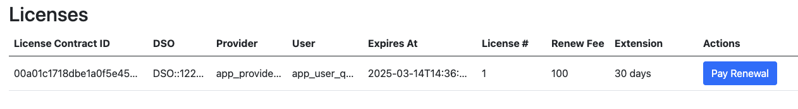

The CC Wallet balance is sufficient to send payment to the Provider.

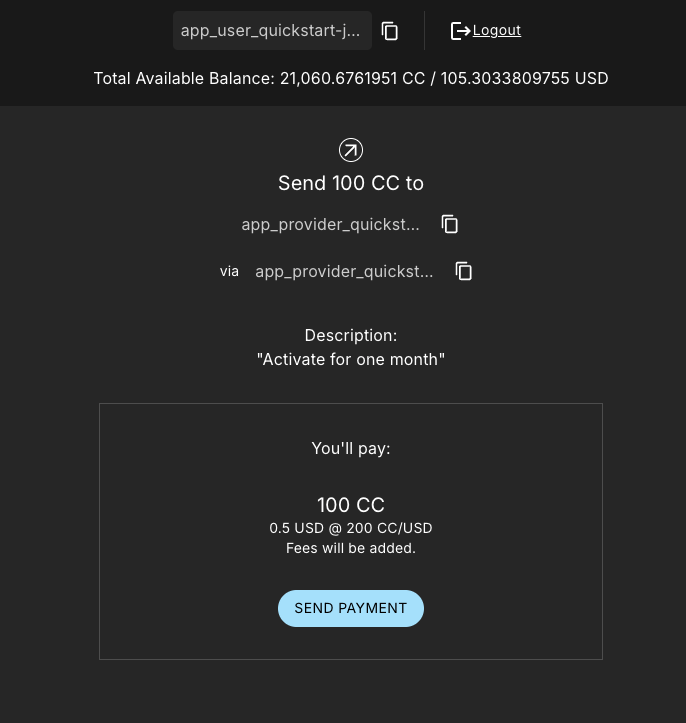

Return to the AppProvider’s License Renewal Requests View.

The AppProvider may now Complete the Renewal.

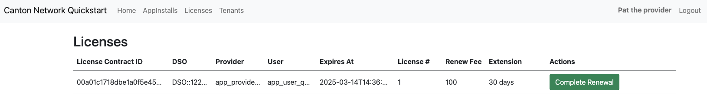

Clicking “Complete Renewal” results in a Success.

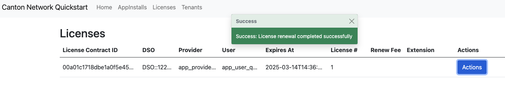

Alice’s License view shows the activated license.

.. image:: images/demo_images/24-activated-license.png

Congratulations. You’ve successfully created and activated a license with a payment transfer!

Canton Console
--------------

The Canton Console connects to the running application ledger. 
The console allows a developer to bypass the UI to interact with the CN in a more direct manner. 
For example, in Canton Console you can connect to the Participant to see the location of the Participant and their synchronizer domain.

The app provider and the app user each have their own console. 
To activate the app provider’s Canton Console in a terminal from the `quickstart/` directory. 
Run:

`make console-app-provider`

Open the participant’s Canton Console with

`make console-app-user`

After the console initiates, run the `participant` and `participant.domains` commands, respectively.

participant

Returns their location in the ledger.

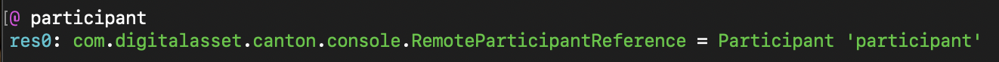

`participant.domains`

Shows the Participant’s synchronizer.

.. image:: images/demo_images/26-console-sync.png

`participant.health.ping(participant)`

Runs a health ping. 
The ping makes a round trip through the CN blockchain. 
Pinging yourself validates communication throughout the entire network.

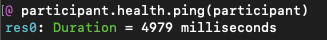

Daml Shell
----------

The Daml Shell connects to the running PQS database of the application provider’s Participant. 
In the Shell, the assets and their details are available in real time.

Run the shell from quickstart/ in the terminal with:

`make shell`

Run the following commands to see the data:

`active`

Shows unique identifiers and the asset count

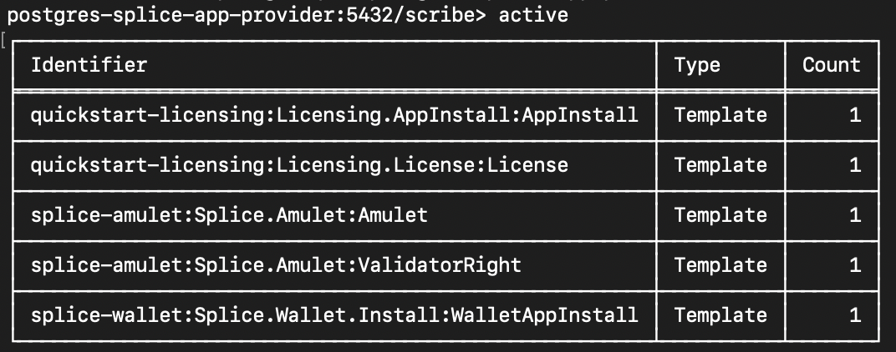

active quickstart-licensing:Licensing.License:License

List the license details.

.. image:: images/demo_images/29-license-details.png

active quickstart-licensing:Licensing.License:LicenseRenewalRequest

Displays license renewal request details.

archives quickstart-licensing:Licensing.AppInstall:AppInstallRequest

Shows any archived license(s).

.. image:: images/demo_images/30-archive-licenses.png

Connect to DevNet
-----------------

Stop the LocalNet containers to change the connection from LocalNet to DevNet.

In the terminal, run:

`make stop && make clean-all`

To edit the connection and observability parameters run:

`make setup`

When prompted to enable LocalNet, enter “n”. This enables DevNet

Optionally, enter “Y” to enable observability. This starts additional containers which may require more memory for Docker.

You may leave the party hint as the default value by tapping ‘return’ on the keyboard.

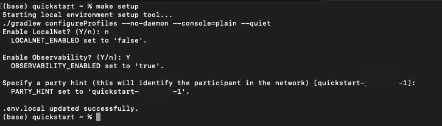

💡Running make setup regenerates `.env.local` but preserves the contents of the `.env` file settings.

The application is now connected to DevNet.

Important: Migration ID for DevNet Connections
~~~~~~~~~~~~~~~~~~~~~~~~~~~~~~~~~~~~~~~~~~~~~~

When connecting to DevNet, verify that the MIGRATION_ID value in `.env` matches the current network migration ID for your DevNet Super Validator (SV).

Check the current migration ID at https://sync.global/sv-network/ under the GSF DevNet information section.

For example, if the SV Node Information shows the migration_id value as “0” then update MIGRATION_ID to “0” in your `.env`.

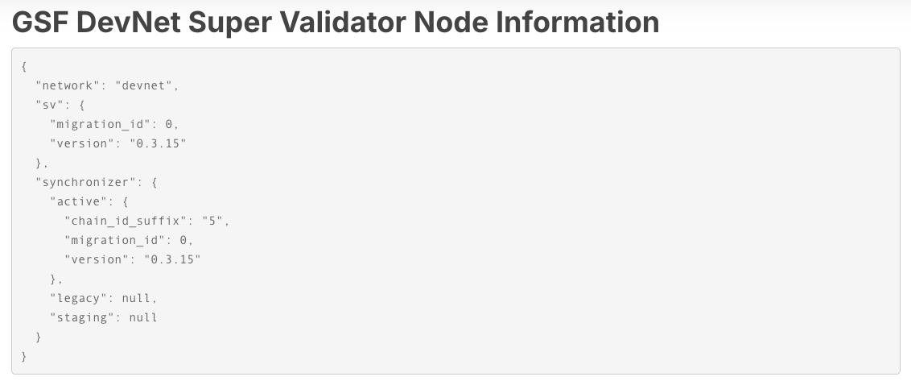

In `.env`:

ONBOARDING_SECRET_URL=https://sv.sv-1.dev.global.canton.network.digitalasset.com/api/sv/v0/devnet/onboard/validator/prepare

MIGRATION_ID=0

APP_PROVIDER_VALIDATOR_PARTICIPANT_ADDRESS=participant-app-provider

APP_USER_VALIDATOR_PARTICIPANT_ADDRESS=participant-app-user

Configuring Non-Default DevNet Sponsors
~~~~~~~~~~~~~~~~~~~~~~~~~~~~~~~~~~~~~~~

In DevNet mode, you can configure a non-default SPONSOR_SV_ADDRESS, SCAN_ADDRESS and ONBOARDING_SECRET_URL or ONBOARDING_SECRET in the quickstart/.env file.

   💡 Connecting to DevNet requires a connection to an `approved SV <https://sync.global/docs/>`__. 
   If your organization provides access to the DAML-VPN, then connect to it to access the Digital Asset-sponsored SV.

   Your organization may sponsor another `CN-approved SV <https://sync.global/sv-network/>`__. 
   If this is the case, speak with your administrator for privileged access.

   Review the DevNet Global Synchronizer documentation to learn more about the `SV onboarding process <https://docs.dev.sync.global/validator_operator/validator_onboarding.html#onboarding-process-overview>`__.

   ⏱️ If you run into errors when making DevNet operations, double check that the DevNet VPN is active. 
   DevNet VPNs may timeout, especially if left unattended for extended periods of time.

In an incognito browser navigate to `localhost:3000/login`. 
Login as the Org1 user and create and archive assets, as before. 
Logout and do the same as the AppProvider.

SV UIs
------

Navigate to http://sv.localhost:4000/ for the SV Web UI. 
The SV view displays data directly from the validator in a GUI that is straightforward to navigate.

Login as ‘administrator’.

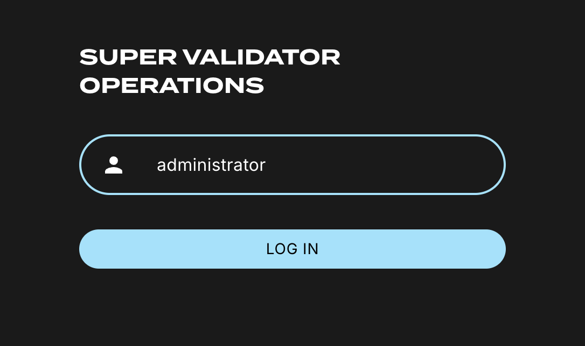

The UI shows information about the SV and lists the active SVs.

.. image:: images/demo_images/34-active-svs.png

The Validator Onboarding menu allows for the creation of validator onboarding secrets.

.. image:: images/demo_images/35-validator-onboarding.png

Canton Coin Scan
~~~~~~~~~~~~~~~~

While connected to DevNet, navigate to the CC Scan Web UI at http://scan.localhost:4000/.

The default activity view shows the total CC balance and the Validator rewards.

.. image:: images/demo_images/36-cc-balance.png

Select the Network Info menu to view SV identification.

.. image:: images/demo_images/34-active-svs.png

The Validators menu shows that the local validator has been registered with the SV.

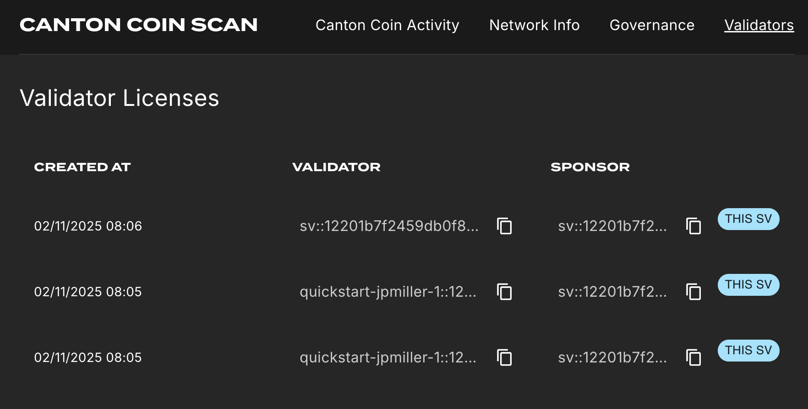

Observability Dashboard
-----------------------

In a web browser, navigate to http://localhost:3030/dashboards to view
the observability dashboards. Select “Quickstart - consolidated logs”.

.. image:: images/demo_images/38-obs-dash.png

The default view shows a running stream of all services.

.. image:: images/demo_images/39-service-stream.png

Change the services filter from “All” to “participant” to view participant logs. 
Select any log entry to view its details.

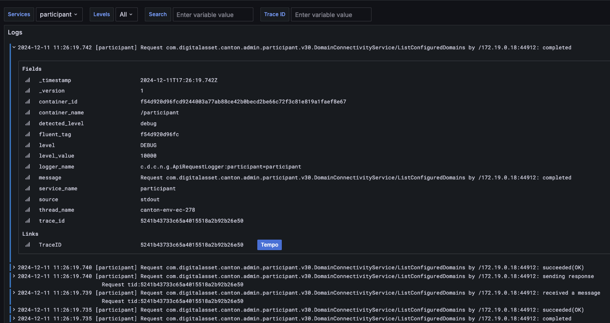

Next Steps
==========

You’ve completed a business operation in the CN QS and have been introduced to the basics of the Canton Console and Daml Shell.

Learn more about Daml Shell and the project structure in the Project Structure Guide.