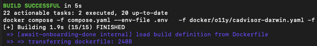

======================================
Canton Network quickstart installation
======================================

**Contents**

`Canton Network quickstart installation <#canton-network-quickstart-installation>`__

`Introduction <#introduction>`__

`Overview <#overview>`__

`Prerequisites <#prerequisites>`__

   `Nix download support <#nix-download-support>`__

`Step-by-step instructions <#step-by-step-instructions>`__

   `Clone from Github <#clone-from-github>`__

   `Artifactory <#artifactory>`__

   `Docker <#docker>`__

   `Install Daml SDK <#install-daml-sdk>`__

   `Deploy a validator on LocalNet <#deploy-a-validator-on-localnet>`__

   `Closing the application <#closing-the-application>`__

   `Close Canton console <#close-canton-console>`__

   `Close Daml Shell <#close-daml-shell>`__

   `Close the CN QS <#close-the-cn-qs>`__

`Next steps <#next-steps>`__

`Resources <#resources>`__

Canton Network quickstart installation
======================================

Introduction
============

The QS is designed to help teams become familiar with CN application development by providing scaffolding to kickstart development.
The QS application is intended to be incrementally extended by you to meet your specific business needs.
Once you are familiar with the QS, please review the technology choices and the application design to determine what changes are needed -
technology and design decisions are ultimately up to you.
Please be aware that the Canton Network Quickstart (CN QS) is a rapidly evolving work in progress.

Overview
========

The CN QS and its guides are a work-in-progress (WIP).
As a result, the CN QS guides may not accurately reflect the state of the application.
If you find errors or other inconsistencies, please contact your representative at Digital Asset.

This guide walks through the installation and ``LocalNet`` deployment of the CN QS.

Prerequisites
=============

Access to the open source `CN-Quickstart Github repository <https://github.com/digital-asset/cn-quickstart>`__
and `CN Docker repository <https://digitalasset.jfrog.io/ui/native/canton-network-docker>`__
is needed to successfully pull the Digital Asset artifacts from JFrog Artifactory.

If you need access to the JFrog Artifactory, email support@digitalasset.com.

Access to the *Daml-VPN* connection or `a SV Node <https://docs.dev.sync.global/validator_operator/validator_onboarding.html>`__
that is whitelisted on the CN is required to connect to DevNet.
The GSF publishes a `list of SV nodes <https://sync.global/sv-network/>`__
who have the ability to sponsor a Validator node.
To access ``DevNet``, contact your sponsoring SV agent for VPN connection information.

If you need access or additional support, email support@digitalasset.com.

The CN QS is a Dockerized application and requires `Docker Desktop <https://www.docker.com/products/docker-desktop/>`__.
Running CN QS is resource intensive.
We recommend allocating 8 GB of memory to Docker Desktop.
If your machine does not have that much memory consider declining Observability when prompted.

Other requirements include:

-  `Curl <https://curl.se/download.html>`__

-  `Direnv <https://direnv.net/docs/installation.html>`__

-  `Nix <https://nixos.org/download/>`__

-  Windows users must install and use `WSL 2 <https://learn.microsoft.com/en-us/windows/wsl/install>`__ with administrator privileges.

Nix download support
--------------------

   Check for Nix on your machine.

   ``nix --version``

   If the command returns something like:

   ``Nix (Nix) 2.25.2``

   Congratulations, you’re done.

   Recommended installation for MacOS.

   ``sh <(curl -L https://nixos.org/nix/install)``

   | Recommended installation for Linux.
   | (Windows users should run this and all following commands in WSL 2).

   ``sh <(curl -L https://nixos.org/nix/install) --daemon``

Step-by-step instructions
=========================

Clone from Github
-----------------

Clone and ``cd`` into the ``cn-quickstart`` repository into your local machine.

::

   git clone https://github.com/digital-asset/cn-quickstart.git
   cd cn-quickstart
   direnv allow

Artifactory
-----------

Check the ~/.netrc file
~~~~~~~~~~~~~~~~~~~~~~~

Necessary artifacts are located in
`Digital Asset's JFrog Artifactory <https://digitalasset.jfrog.io/ui/native/canton-network-docker>`__.
These files are accessed through the repository’s build system using a ``~/.netrc`` configuration file.

Check if a ``~/.netrc`` file already exists.

``cat ~/.netrc``

Create or edit the ``~/.netrc`` file at root.

``vim ~/.netrc``

Paste the boiler plate content into ``~/.netrc``.

::

   machine digitalasset.jfrog.io
   login <username>
   password <identity_token>

Locate login for ~/.netrc
~~~~~~~~~~~~~~~~~~~~~~~~~

Log into JFrog.
Click the profile icon in the top right corner and then click **Edit Profile**.

Your email address is the login username in ``~/.netrc``.
Replace ``<username>`` with the JFrog Artifactory user profile email.

.. image:: images/02-jfrog-user-profile.png
   :alt: JFrog user profile

Create an Identity Token
~~~~~~~~~~~~~~~~~~~~~~~~

Toward the bottom of the same profile page, click "Generate an Identity Token."

Add an identity token description.

Copy the Identity Token as shown under "Reference Token."
The Identity Token is also referred to as the "Reference Token" and the "API key" in JFrog and is the password in ``~/.netrc``.

Complete ~/.netrc
~~~~~~~~~~~~~~~~~

The Identity Token is stored as the password in ``~/.netrc``.
Replace ``<identity_token>`` with the Identity Token (also referred to as the Reference Token) from your JFrog profile.
When complete, the ``~/.netrc`` file will look similar to:

::

   machine digitalasset.jfrog.io
   login email@domain.com
   password cmVmdGtuOjAxOjE3Nzg5NTQzNjc6UmhYaFNaZWpUNGtFMzJyYXRyWEQya...

Manually set ``.netrc``’s permissions.

``chmod 600 ~/.netrc``

Check for Artifactory connectivity using ``.netrc`` credentials after populating the username and password.

::

   curl -v --netrc
   "https://digitalasset.jfrog.io/artifactory/api/system/ping"`

.. image:: images/04-jfrog-ping.png
   :alt: JFrog connection ping

A response of “OK” indicates a successful connection.

Authentication problems often result in a ``401`` or ``403`` error.
If an error response occurs, double check ``~/.netrc`` to confirm that ``.netrc`` is a source file (in root) and not a local file.

Docker
------

Verify that Docker Desktop is running.

Login to Docker repositories via the terminal.

::

   docker login digitalasset-docker.jfrog.io
   docker login digitalasset-canton-network-docker.jfrog.io
   docker login

The last command requires a `Docker Hub <https://app.docker.com/>`__
username and password or *Personal Access Token (PAT)*.
Commands should return ‘Login Succeeded’.

Install Daml SDK
----------------

``cd`` into the ``quickstart`` subdirectory and install the Daml SDK from the quickstart subdirectory.

::

   cd quickstart
   make install-daml-sdk

.. note:: The ``makefile`` providing project choreography is in the ``quickstart/`` directory.
          ``make`` only operates within ``quickstart/``.
          If you see errors related to ``make``, double check your present working directory.

The Daml SDK is large and can take several minutes to complete.

.. image:: images/06-unpack-sdk.png
   :alt: Daml SDK unpacking

.. note:: The CN QS uses Java SDK version ``Eclipse Temurin JDK version 17.0.12+7``.
   The Java SDK runs within the Docker container.

Deploy a validator on LocalNet
------------------------------

From the quickstart subdirectory, build the application.

``make build``

Once complete, start the application, Canton services and Observability.

``make start``

The first time running ``make start``, a helper assistant prompts to set up a local deployment.
It offers the choice of running ``DevNet`` or ``LocalNet``,
enabling ``Observability``, and specifying a party hint.
In the future, this helper can be accessed by running ``make setup``.

Begin the first application in ``LocalNet`` with ``Observability`` enabled.
Leave the party hint blank to use the default.

   The party hint is used as a party node’s alias of their identification hash.
   The Party Hint is not part of the user’s identity.
   It is a convenience feature.
   It is possible to have multiple party nodes with the same hint.

| Enable LocalNet? (Y/n): Y
| LOCALNET_ENABLED set to ‘true’.

| Enable Observability? (Y/n): Y
| OBSERVABILITY_ENABLED set to ‘true’.

| Specify a party hint (this will identify the participant in the
  network) [quickstart-USERNAME-1]:
| PARTY_HINT set to ‘quickstart-USERNAME-1’.

``.env.local`` updated successfully.

   Consider declining Observability if your machine has less than 8 GB of memory to allocate to Docker Desktop.

If prompted to re-run ``make start``, do so.

``make start``

.. image:: images/10-make-start.png
   :alt: Make start

In the future, you may run the following series of commands from ``cn-quickstart/`` to clone and initiate Quickstart:

::

   git pull; cd quickstart; make install-daml-sdk; make setup; make build;
   make start

In a separate shell, from the quickstart subdirectory, run the Canton Consoles.

::

   make console-app-provider
   make console-app-user

.. image:: images/11-canton-console.png
   :alt: Canton console

In a third shell, from the quickstart subdirectory, begin the Daml Shell.

``make shell``

.. image:: images/12-daml-shell.png
   :alt: Daml shell

Closing the application
-----------------------

*⚠️ (If you plan on immediately using the CN QS then delay execution of this section)*

Close Canton console
~~~~~~~~~~~~~~~~~~~~

When complete, open the Canton console terminal.
Run ``exit`` to stop and remove the console container.

Close Daml shell
~~~~~~~~~~~~~~~~

In the Daml shell terminal, execute ``quit`` to stop the shell container.

Close the CN QS
~~~~~~~~~~~~~~~

Finally, close the application and observability services with:

``make stop && make clean-all``

It is wise to run make ``clean-all`` during development and at the end of each session to avoid conflict errors on subsequent application builds.

Next steps
==========

You have successfully installed the CN QS.
The next section, “Exploring The Demo,” provides a demonstration of the application in ``LocalNet`` and ``DevNet`` environments.

Resources
=========

`Curl <https://curl.se/download.html>`__

`Direnv <https://direnv.net/docs/installation.html>`__

`Docker Desktop <https://www.docker.com/products/docker-desktop/>`__

`Docker Hub <https://app.docker.com/>`__

`GSF list of SV Nodes <https://sync.global/sv-network/>`__

`JFrog CN
Artifactory <https://digitalasset.jfrog.io/ui/native/canton-network-docker>`__

`Nix <https://nixos.org/download/>`__

`Quickstart GitHub
repository <https://github.com/digital-asset/cn-quickstart>`__

`Validator onboarding
documentation <https://docs.dev.sync.global/validator_operator/validator_onboarding.html>`__

`WSL 2 <https://learn.microsoft.com/en-us/windows/wsl/install>`__
