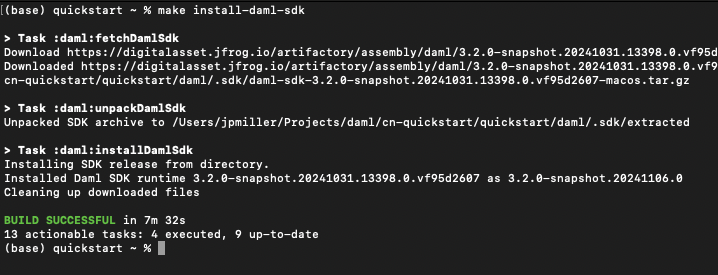

======================================
Canton Network quickstart installation
======================================

.. contents:: Contents
   :depth: 2
   :local:
   :backlinks: top

Introduction
============

The Quickstart application helps you and your team become familiar with CN application development by providing **essential** scaffolding. 
The Quickstart application provides a launchpad and is intended to be extended to meet your business needs. 
When you are familiar with the Quickstart, review the technology choices and application design to determine what changes are needed.
Technology and design decisions are ultimately up to you.

Overview
========

This guide walks through the installation and ``LocalNet`` deployment of the CN Quickstart.
We have provided a `fast path installation <#fast-path-installation>`__ 
and `step-by-step instructions <#step-by-step-instructions>`__, based on level of experience, for your convenience.
Please contact your representative at Digital Asset if you find errors.

Roadmap
-------

 * After installation, :ref:`quickstart-explore-the-demo` to complete a business operation in the example application.
 * For an overview of how the Quickstart project is structured, read :ref:`quickstart-project-structure-overview`.
 * Learn about debugging features in the :ref:`quickstart-observability-troubleshooting-overview`.

Prerequisites
=============

Access to the `CN-Quickstart GitHub repository <https://github.com/digital-asset/cn-quickstart>`__
and `digitalasset-docker.jfrog.io` JFrog Artifactory docker repository is needed to successfully pull the Digital Asset artifacts.

`Contact us <https://www.digitalasset.com/contact-us?comments=I%27m%20requesting%20access%20to%20jFrog>`__ if you need access or additional support.

The CN Quickstart is a Dockerized application and requires `Docker Desktop <https://www.docker.com/products/docker-desktop/>`__. 
We recommend allocating 8 GB of memory to Docker Desktop. 
Allocate additional resources if you witness unhealthy containers, if possible.
Decline Observability if your machine does not have sufficient memory.

Other requirements include:
  -  `Curl <https://curl.se/download.html>`__

  -  `Direnv <https://direnv.net/docs/installation.html>`__

  -  `Nix <https://nixos.org/download/>`__

  -  Windows users must install and use
     `WSL 2 <https://learn.microsoft.com/en-us/windows/wsl/install>`__ with
     administrator privileges.

Nix download support
--------------------

   Check for Nix on your machine.

   ``nix --version``

   If the command returns something like:

   ``Nix (Nix) 2.25.2``

   Congratulations, you’re done.

   Recommended installation for MacOS.

   ``sh <(curl -L https://nixos.org/nix/install)``

   | Recommended installation for Linux.
   | (Windows users should run this and all following commands in WSL 2).

   ``sh <(curl -L https://nixos.org/nix/install) --daemon``

Fast path installation
======================

If you are familiar with the prerequisites and have access to JFrog Artifactory, use these abbreviated installation instructions.
More detailed instructions are provided below.

1. `Clone from GitHub <#clone-from-github>`__ and cd into the ``cn-quickstart`` repository: ``git clone https://github.com/digital-asset/cn-quickstart.git``
2. Paste your `jfrog login <#artifactory>`__ and identity token into a global ``~/.netrc`` file.

::

   machine digitalasset.jfrog.io
   login <username>
   password <identity_token>

3. Manually set ``.netrc``’s permissions: ``chmod 600 ~/.netrc``
4. Check for Artifactory connectivity using ``.netrc`` credentials: ``curl -v --netrc "https://digitalasset.jfrog.io/artifactory/api/system/ping"``
5. Verify that the `Docker Desktop <#docker>`__ app is running on your computer: ``docker info``
6. Login to Docker repositories via the terminal: ``docker login digitalasset-docker.jfrog.io`` and ``docker login``
7. **cd** into the ``quickstart`` subdirectory: ``cd quickstart``
8. `Install the Daml SDK <#install-daml-sdk>`__ from the quickstart subdirectory: ``make install-daml-sdk``
9. `Configure the local development <#deploy-a-validator-on-localnet>`__ environment: ``make setup``
10. When prompted, enable Observability and OAuth2, leave the party hint blank to use the default, and disable TEST MODE.
11. Build the application from the ``quickstart`` subdirectory: ``make build``
12. Start the application, Canton services and Observability: ``make start``
13. Optional - In a separate shell, from the ``quickstart`` subdirectory, run the `Canton Console <#connecting-to-the-local-canton-nodes>`__: ``make canton-console``
14. Optional - In a third shell, from the quickstart subdirectory, begin the Daml Shell: ``make shell``
15. When complete, `close the application <#closing-the-application>`__ and observability services with: ``make stop && make clean-all``
16. If applicable, close Canton Console with ``exit`` and close Daml Shell with ``quit``.

Step-by-step instructions
=========================

Clone from GitHub
-----------------

Clone and **cd** into the ``cn-quickstart`` repository into your local machine.

::

   git clone https://github.com/digital-asset/cn-quickstart.git
   cd cn-quickstart
   direnv allow

.. image:: images/01-allow-direnv.png
   :alt: allow direnv

Artifactory
-----------

Check the ~/.netrc file
~~~~~~~~~~~~~~~~~~~~~~~

Necessary artifacts are located in
`Digital Asset's JFrog Artifactory <https://digitalasset.jfrog.io/ui/native/docker>`__.
These files are accessed through the repository’s build system using a ``~/.netrc`` configuration file.

Check if a ``~/.netrc`` file already exists.

::

  `cat ~/.netrc`

Create or edit the ``~/.netrc`` file at root.

::

  `vim ~/.netrc`

Paste the boiler plate content into ``~/.netrc``.

::

   machine digitalasset.jfrog.io
   login <username>
   password <identity_token>

Locate login for ~/.netrc
~~~~~~~~~~~~~~~~~~~~~~~~~

Log into JFrog. 

Click the profile icon in the top right corner and then click **Edit Profile**.

Your email address is the login username in ``~/.netrc``.
Replace ``<username>`` with the JFrog Artifactory user profile email.

Create an Identity Token
~~~~~~~~~~~~~~~~~~~~~~~~

Toward the bottom of the same profile page, click "Generate an Identity Token."

.. image:: images/03-generate-jfrog-token.png
   :alt: JFrog generate identity token
   :width: 30%

Add an identity token description.

.. image:: images/03b-gen-id-token.png
   :alt: JFrog API Key
   :width: 30%

Copy the Identity Token as shown under "Reference Token." 

The Identity Token is also referred to as the "Reference Token" and the "API
key" in JFrog and is the password in ``~/.netrc``.

.. image:: images/03c-copy-ref-token.png
   :alt: New Reference Token
   :width: 30%

Complete ~/.netrc
~~~~~~~~~~~~~~~~~

The Identity Token is stored as the password in ``~/.netrc``. 

Replace ``<identity_token>`` with the Identity Token (also referred to as the
Reference Token) from your JFrog profile.

When complete, the ``~/.netrc`` file will look similar to:

::

   machine digitalasset.jfrog.io
   login email@domain.com
   password cmVmdGtuOjAxOjE3Nzg5NTQzNjc6UmhYaFNaZWpUNGtFMzJyYXRyWEQya...

Manually set ``.netrc``’s permissions.

::

  `chmod 600 ~/.netrc`

Check for Artifactory connectivity using ``.netrc`` credentials after populating
the username and password.

::

   curl -v --netrc
   "https://digitalasset.jfrog.io/artifactory/api/system/ping"`

A response of “OK” indicates a successful connection.

Authentication problems often result in a ``401`` or ``403`` error. 

If an error response occurs, double check ``~/.netrc`` to confirm that ``.netrc`` is
a source file (in root) and not a local file.

Docker
------

Verify that the Docker Desktop application is running on your computer.

Login to Docker repositories via the terminal.

::

   docker login digitalasset-docker.jfrog.io
   docker login

The last command requires a `Docker Hub <https://app.docker.com/>`__ username
and password or *Personal Access Token (PAT)*. 

Commands should return ‘Login Succeeded’.

Install Daml SDK
----------------

**cd** into the ``quickstart`` subdirectory and install the Daml SDK from the
quickstart subdirectory.

::

   cd quickstart
   make install-daml-sdk

.. note:: The `Makefile` providing project choreography is in the `quickstart/`
          directory. `make` only operates within `quickstart/`.
   
          If you see errors related to `make`, double check your present working
          directory.

The Daml SDK is large and can take several minutes to complete.

Deploy a validator on LocalNet
------------------------------

Configure the local development environment by running ``make setup``.

Enable `Observability` and OAuth2. 
Leave the party hint blank to use the default and disable ``TEST MODE``. 

  The party hint is used as a party node’s alias of their identification hash.
  The Party Hint is not part of the user’s identity. 
  It is a convenience feature. 
  It is possible to have multiple party nodes with the same hint.

::

  | % make setup
  |  Starting local environment setup tool...
  |  ./gradlew configureProfiles --no-daemon --console=plain --quiet
  |  Enable Observability? (Y/n): y
  |  OBSERVABILITY_ENABLED set to 'true'.

  | Enable OAUTH2? (Y/n): y
  | AUTH_MODE set to 'oauth2'.

  | Specify a party hint (this will identify the participant in the
    network) [quickstart-USERNAME-1]:
  | PARTY_HINT set to ‘quickstart-USERNAME-1’.

  | Enable TEST_MODE? (y/N): n
  |   TEST_MODE set to 'off'.

  | ``.env.local`` updated successfully.

You can change these choices any time by running ``make setup`` again.

   OAuth2 and Observability may be unstable if your machine has less than 8 GB of memory to allocate to Docker Desktop.

Build the application.

::

  `make build`

.. image:: images/07-build-success-1.png
   :alt: Build success

Once complete, start the application, Canton services and Observability.

::

  `make start`

Connecting to the Local Canton Nodes
------------------------------------

In a separate shell, from the ``quickstart`` subdirectory, run the Canton Console.

::

   make canton-console

.. image:: images/11-canton-console.png
   :alt: Canton console

In a third shell, from the quickstart subdirectory, begin the Daml Shell.

::

  `make shell`

.. image:: images/12-daml-shell.png
   :alt: Daml shell

Closing the application
-----------------------

*⚠️ (If you plan on immediately using the CN Quickstart then delay execution of this section)*

Close Canton console
~~~~~~~~~~~~~~~~~~~~

When complete, open the Canton console terminal.
Run ``exit`` to stop and remove the console container.

Close Daml shell
~~~~~~~~~~~~~~~~

In the Daml shell terminal, execute ``quit`` to stop the shell container.

Close the CN Quickstart
~~~~~~~~~~~~~~~~~~~~~~~

Finally, close the application and observability services with:

::

  `make stop && make clean-all`

It is wise to run make ``clean-all`` during development and at the end of each
session to avoid conflict errors on subsequent application builds.

Next steps
==========

You have successfully installed the CN Quickstart. 

The next section, “Exploring The Demo,” provides a demonstration of the
example application.

Connecting your application to The Canton Network
-------------------------------------------------

The ``LocalNet`` deployment connects to a local validator which is in turn
connected to a local super-validator (synchronizer). Staging and final
production deployments require connecting to a validator that is in turn
connected to the public Canton Network.

The Canton Network provides three synchronizer pools. The production network
is ``MainNet``; the production staging network is ``TestNet``. As a developer you
will mostly be connecting to the development staging network ``DevNet``.

Access to `a SV Node <https://docs.dev.sync.global/validator_operator/validator_onboarding.html>`__
that is whitelisted on the CN is required to connect to DevNet. The GSF
publishes a `list of SV nodes <https://sync.global/sv-network/>`__ who have the
ability to sponsor a Validator node. To access ``DevNet``, contact your
sponsoring SV agent for VPN connection information.

Resources
=========

  * `Curl <https://curl.se/download.html>`__
  * `Direnv <https://direnv.net/docs/installation.html>`__
  * `Docker Desktop <https://www.docker.com/products/docker-desktop/>`__
  * `Docker Hub <https://app.docker.com/>`__
  * `GSF list of SV Nodes <https://sync.global/sv-network/>`__
  * `JFrog Artifactory DA Docker <https://digitalasset.jfrog.io/ui/native/docker>`__
  * `Nix <https://nixos.org/download/>`__
  * `Quickstart GitHub repository <https://github.com/digital-asset/cn-quickstart>`__
  * `Validator onboarding documentation <https://docs.dev.sync.global/validator_operator/validator_onboarding.html>`__
  * `WSL 2 <https://learn.microsoft.com/en-us/windows/wsl/install>`__
