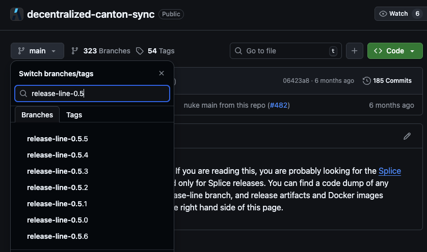
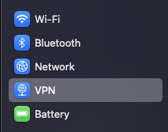
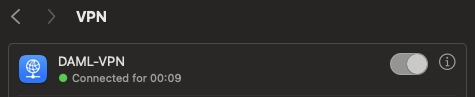
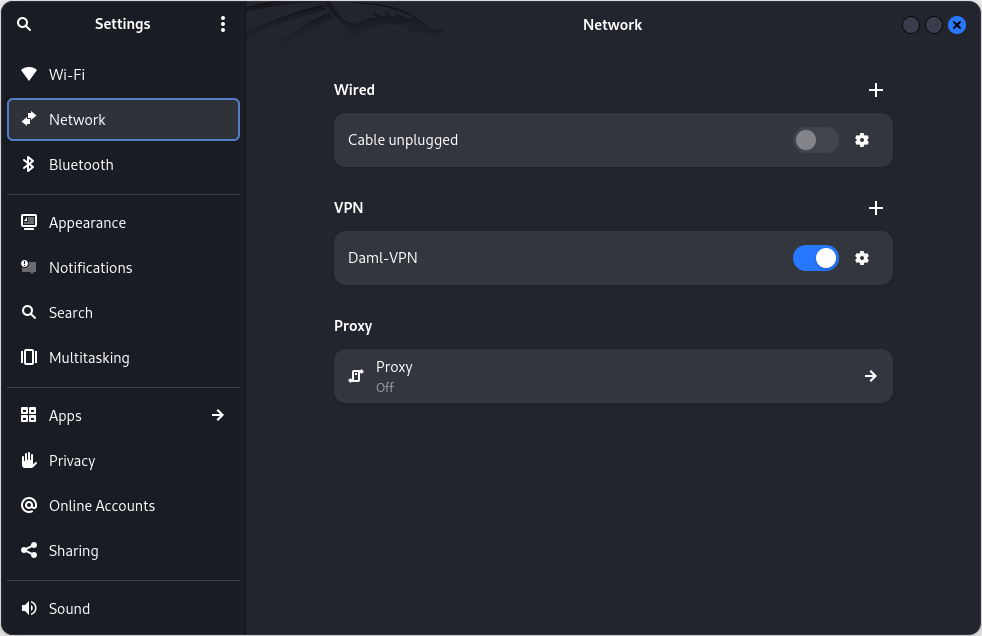
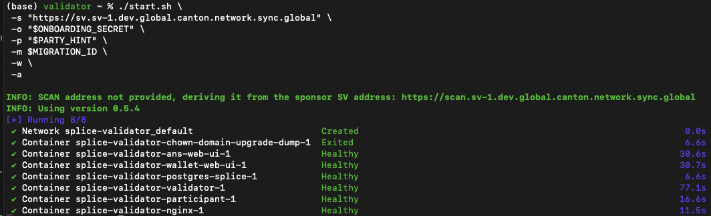
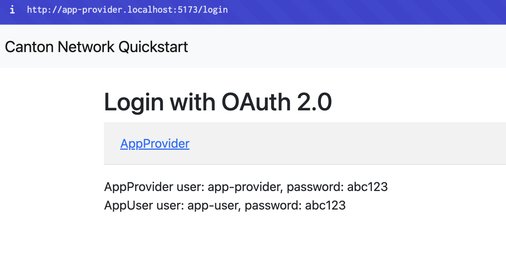
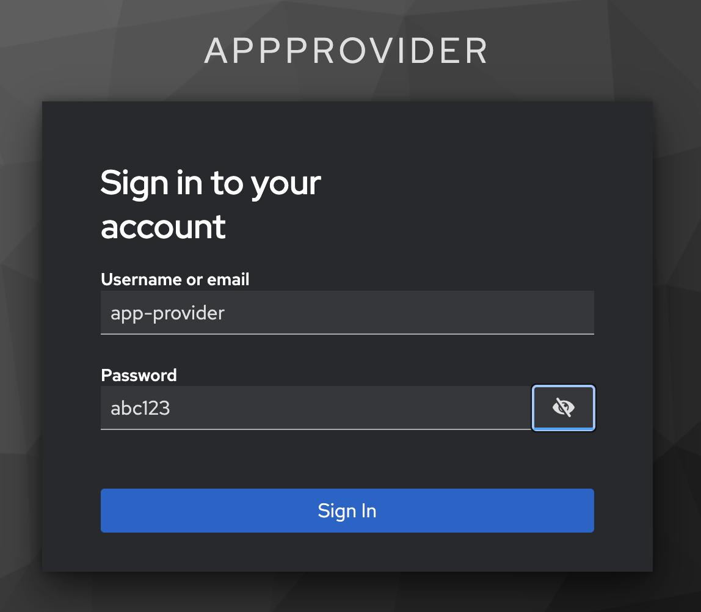
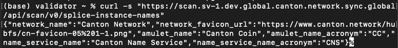
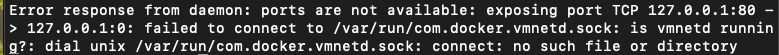
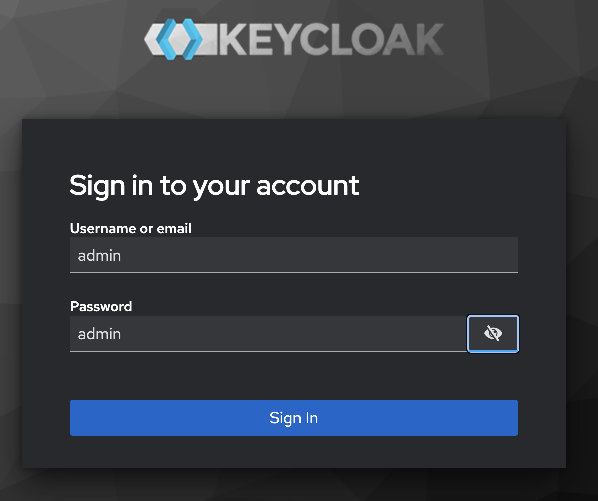

.. _deploy-quickstart-to-devnet:

Deploy Quickstart to DevNet
===========================

Overview
--------

In this guide, you'll deploy the Quickstart app from LocalNet to DevNet.
You'll deploy the original DAR, deploy to the backend, frontend and test the workflow.

You should have the Quickstart application :ref:`installed <quickstart-cnqs-installation>`
and understand the :ref:`quickstart-project-structure-guide`.

DevNet validator prerequisite
-----------------------------

You must have successfully submitted a validator request to successfully complete this guide.

Submit your request at: https://canton.foundation/apply-to-set-up-a-validator-node/

Visit the global synchronizer docs to learn more about the validator onboarding process and how to deploy a validator with Docker Compose.

You can find up-to-date Canton Foundation DevNet Super Validator Node Information at:
https://canton.foundation/sv-network-status/

Architectural overview
----------------------

The Quickstart DevNet deployment splits across two components:

- **splice-node**: Provides the validator infrastructure (participant, validator, wallet-ui, ans-ui)
- **cn-quickstart**: Provides the application layer (keycloak, pqs, backend-service, frontend)

.. code-block:: text

   ┌────────────────────────────────────────────────────────────────┐
   │                         splice-node                            │
   │  ┌─────────────┐  ┌─────────────┐  ┌──────────┐  ┌──────────┐  │
   │  │ Participant │  │  Validator  │  │ Wallet-UI│  │  ANS-UI  │  │
   │  │   :8080     │  │   :5012     │  │  :3000   │  │  :3000   │  │
   │  └─────────────┘  └─────────────┘  └──────────┘  └──────────┘  │
   └────────────────────────────────────────────────────────────────┘
            │                  │
            │ Ledger API       │ Registry API
            ▼                  ▼
   ┌────────────────────────────────────────────────────────────────┐
   │                         cn-quickstart                          │
   │  ┌──────────┐  ┌──────────┐  ┌─────────────┐  ┌─────────────┐  │
   │  │ Keycloak │  │   PQS    │  │  Backend    │  │  Frontend   │  │
   │  │  :8082   │  │ (scribe) │  │   :8089     │  │   :5173     │  │
   │  └──────────┘  └──────────┘  └─────────────┘  └─────────────┘  │
   └────────────────────────────────────────────────────────────────┘

``splice-node`` ports are internal container ports and routed via nginx by hostname.
``cn-quickstart`` ports are directly exposed.

The frontend communicates with the backend via HTTP REST calls to ``/api/*`` endpoints.
The Vite development server proxies these requests to the backend, which translates them into Ledger API calls.
For a detailed explanation of this fully mediated architecture, see :ref:`quickstart-project-structure-guide`.

Quickstart configuration for DevNet
-----------------------------------

Quickstart environment variables are set for ``LocalNet`` usage by default,
but ledger connections differ between ``LocalNet`` and ``DevNet`` configurations.
For example:

.. list-table::
   :header-rows: 1
   :widths: 25 40 30

   * - Variable
     - LocalNet Value
     - DevNet Value
   * - ``LEDGER_HOST``
     - ``localhost``
     - ``grpc-ledger-api.localhost``
   * - ``LEDGER_PORT``
     - ``5001``
     - ``80`` or ``8080``

.. _configure-host-entries:

Configure Host entries
----------------------

``nginx.conf`` uses virtual hosting to route requests to backend services.
As a result, nginx inspects your ``Host`` HTTP header to determine backend routing.
Add explicit host entires for reliable routing.

Add these entries to ``/etc/hosts``:

.. code-block:: bash

   sudo vim /etc/hosts

   127.0.0.1 json-ledger-api.localhost
   127.0.0.1 grpc-ledger-api.localhost
   127.0.0.1 validator.localhost
   127.0.0.1 app-provider.localhost
   127.0.0.1 participant.localhost
   127.0.0.1 wallet.localhost
   127.0.0.1 ans.localhost
   127.0.0.1 keycloak.localhost
   127.0.0.1 host.docker.internal

You only need to complete this step one time.

.. list-table:: DevNet Host Entries
   :header-rows: 1
   :widths: 25 45 30

   * - Host Entry
     - URL
     - Purpose
   * - ``json-ledger-api.localhost``
     - ``http://json-ledger-api.localhost/``
     - JSON Ledger API (REST commands, DAR uploads)
   * - ``grpc-ledger-api.localhost``
     - ``http://grpc-ledger-api.localhost/``
     - gRPC Ledger API (backend's ``LEDGER_HOST``)
   * - ``validator.localhost``
     - ``http://validator.localhost/``
     - Validator application API
   * - ``wallet.localhost``
     - ``http://wallet.localhost/``
     - Canton Wallet web interface
   * - ``app-provider.localhost``
     - ``http://app-provider.localhost:5173/``
     - Quickstart frontend web interface
   * - ``participant.localhost``
     - ``http://participant.localhost/``
     - Participant admin/metrics
   * - ``ans.localhost``
     - ``http://ans.localhost/``
     - Canton Name Service (ANS) web interface
   * - ``keycloak.localhost``
     - ``http://keycloak.localhost:8082/``
     - OAuth2/OIDC provider

The nginx proxy routes based on hostname. Default port is 80.
MacOS users may need to change the validator port from 80 to 8080 to avoid
``vmnetd`` errors. See :ref:`vmnetd-error` in the Troubleshooting section.

Clone the Splice-Node Validator repository
------------------------------------------

In ``DevNet``, your Splice node validator runs locally and connects to the ``DevNet`` synchronizer.

Clone the correct version of the Splice-node repository and navigate to the validator Docker Compose directory.
As of the writing of this document, the most up to date version is 0.5.8.

.. note::

   You can check for the most up to date release for yourself by navigating to https://github.com/digital-asset/decentralized-canton-sync.
   Click on "Main" then search through the ``release-line`` options.

The following link downloads the ``0.5.8 splice-node`` release.
Move the downloaded file to the location of your choice.
(To download a different release, simply edit the version numbers in the URL).

Click the link to download the splice node release:
https://github.com/digital-asset/decentralized-canton-sync/releases/download/v0.5.8/0.5.8_splice-node.tar.gz

Move the ``splice-node`` tarball to your desired location and then unzip it.

.. code-block:: bash

   tar xzvf 0.5.8_splice-node.tar.gz

The new ``splice-node`` repo and ``cn-quickstart`` should be siblings to one another.

::

   .
   ├── Canton_Network_App_Dev
   │   ├── cn-quickstart
   └── └── splice-node

.. note::

   You only need to complete this step one time for any given ``splice-node release``.

Navigate to the validator's Docker Compose directory
----------------------------------------------------

.. code-block:: bash

   cd splice-node/docker-compose/validator

Connect to a Canton Network Validator Node
------------------------------------------

Navigate to your OS's VPN settings, then connect to your sponsoring validator node.

VPN access is required for ``DevNet``. Contact your sponsoring SV for VPN credentials.

Mac OS
^^^^^^

Settings > VPN

Enable your Canton Network VPN

Linux
^^^^^

Network > VPN

Clean Docker
------------

Clear Docker If this is not your first time connecting to ``DevNet`` so that stale containers do not interfere.

.. code-block:: bash

   docker compose down -v

Get network information
-----------------------

Retrieve DevNet migration ID and Splice version
^^^^^^^^^^^^^^^^^^^^^^^^^^^^^^^^^^^^^^^^^^^^^^^

In terminal, from the ``/validator`` directory run:

.. code-block:: bash

   INFO_URL="https://docs.dev.global.canton.network.sync.global/info"
   SPLICE_VERSION=$(curl -s "$INFO_URL" | jq -r '.synchronizer?.active?.version')
   MIGRATION_ID=$(curl -s "$INFO_URL" | jq -r '.synchronizer?.active?.migration_id')

   echo "Splice Version: $SPLICE_VERSION"
   echo "Migration ID: $MIGRATION_ID"

Verify that the Splice version matches the splice-node version that you recently downloaded and unzipped.
Minor Splice versions change on a regular basis.
You may elect to hard code ``SPLICE_VERSION`` rather than saving the most recent version. e.g. ``SPLICE_VERSION=0.5.8``

Get the onboarding secret
^^^^^^^^^^^^^^^^^^^^^^^^^

You may use the following Super Validator URL if you are connected to the Canton Network Global Synchronizer.
If not, your sponsoring SV will provide the appropriate URL.
In this case, you must replace the provided ``SPONSOR_SV_URL`` with your provided URL.

.. code-block:: bash

   # GSF Sponsor SV URL for DevNet
   SPONSOR_SV_URL="https://sv.sv-1.dev.global.canton.network.sync.global"

   # Request and store the onboarding secret
   ONBOARDING_SECRET=$(curl -s -X POST "$SPONSOR_SV_URL/api/sv/v0/devnet/onboard/validator/prepare")
   echo $ONBOARDING_SECRET

.. tip::

   The onboarding secret is only good for 1 hour.
   If containers ever show unhealthy, try requesting a new onboarding secret as your first step in troubleshooting.

Party Hint
^^^^^^^^^^

Set a Party Hint.
The party hint must match the expected hint that is established when running ``make setup`` from ``cn-quickstart/quickstart``.

If you don't remember your party hint, you can open a terminal and navigate to ``cn-quickstart/quickstart/``, then run ``make setup``.

The default party hint is ``quickstart-USERNAME-1``

Return to the terminal in the ``validator`` directory. Set ``PARTY_HINT``.

.. code-block:: bash

   PARTY_HINT="quickstart-USERNAME-1"

This value must match the expected party hint.

Authentication
--------------

.. note::

   If you would like to connect to ``DevNet`` without authentication, you may skip this section and initiate the ``start.sh`` script without the ``-a`` flag.

Update authentication variables in ``splice-node/docker-compose/validator/.env`` using Quickstart's pre-configured Keycloak values.
The following Authentication values can be found in ``cn-quickstart``'s keycloak ``env``, realm and user JSON files.
Files include ``quickstart/quickstart/docker/modules/keycloak/compose.env``, ``AppProvider-realm.json``, and ``AppProvider-users-0.json``.

``splice-node/docker-compose/validator/.env``

.. code-block:: bash

   # Authentication

   # OIDC Provider URLs
   AUTH_URL="http://keycloak.localhost:8082"
   AUTH_JWKS_URL="http://host.docker.internal:8082/realms/AppProvider/protocol/openid-connect/certs"
   AUTH_WELLKNOWN_URL="http://host.docker.internal:8082/realms/AppProvider/.well-known/openid-configuration"

   # Audiences
   LEDGER_API_AUTH_AUDIENCE="https://canton.network.global"
   LEDGER_API_AUTH_SCOPE=""       # Optional, leave empty
   VALIDATOR_AUTH_AUDIENCE="https://canton.network.global"

   # Validator client credentials
   VALIDATOR_AUTH_CLIENT_ID="app-provider-validator"
   VALIDATOR_AUTH_CLIENT_SECRET="AL8648b9SfdTFImq7FV56Vd0KHifHBuC"

   # Admin users 
   LEDGER_API_ADMIN_USER="service-account-app-provider-validator"
   WALLET_ADMIN_USER="app-provider"

   # UI Clients
   WALLET_UI_CLIENT_ID="app-provider-wallet"
   ANS_UI_CLIENT_ID="app-provider-ans"

.. note::

   These are development secrets and should be changed for production.

Start the validator with the start.sh script.
---------------------------------------------

Verify that you are in the ``validator`` directory, then run this command to connect to ``DevNet``:

.. code-block:: bash

   ./start.sh \
    -s "https://sv.sv-1.dev.global.canton.network.sync.global" \
    -o "$ONBOARDING_SECRET" \
    -p "$PARTY_HINT" \
    -m $MIGRATION_ID \
    -w \
    -a

Flag descriptions
^^^^^^^^^^^^^^^^^

.. list-table::
   :header-rows: 1
   :widths: 10 40

   * - Flag
     - Description
   * - ``-s``
     - Sponsor SV URL
   * - ``-o``
     - Onboarding secret
   * - ``-p``
     - Your unique party hint
   * - ``-m``
     - Migration ID (a non-negative integer)
   * - ``-w``
     - Wait for validator to be fully operational
   * - ``-a``
     - Enable authentication

.. note::

   You can omit the ``-a`` flag to skip authentication setup.
   This may make initial testing easier, but you should enable authentication for production use.

While ``DevNet`` is starting, move on to the next step.
(You'll need to complete the next step before ``DevNet`` is able to connect).

Spin up the Quickstart DevNet
-----------------------------

In a second terminal, navigate to the Quickstart ``DevNet`` Docker Compose directory.

.. code-block:: bash

   cd cn-quickstart/quickstart/docker/modules/devnet

   docker compose --env-file compose.env --profile devnet up -d postgres-keycloak keycloak nginx-keycloak postgres-pqs pqs-app-provider backend-service

.. code-block:: text

   devnet ~ % docker compose --env-file compose.env --profile devnet up -d postgres-keycloak keycloak nginx-keycloak postgres-pqs pqs-app-provider backend-service
   [+] Running 7/7
    ✔ Container postgres-pqs          Healthy                  27.5s 
    ✔ Container postgres-keycloak     Healthy                  6.2s 
    ✔ Container keycloak              Healthy                  26.7s 
    ✔ Container nginx-keycloak        Started                  26.7s 
    ✔ Container splice-onboarding     Healthy                  41.3s 
    ✔ Container pqs-app-provider      Started                  27.3s 
    ✔ Container backend-service       Started                  41.4s 

``DevNet`` connects shortly after spinning up the docker containers.
A successful connection shows healthy containers.

.. note::

   See the Troubleshooting section if you experience a ``vmnetd`` error.

Build and upload the DAR
------------------------

Return to the ``/quickstart`` directory.

.. code-block:: bash

   cd ../../../

Then build the Daml code.

.. code-block:: bash

   make build-daml

Verify that the ``DAR`` was created.

.. code-block:: bash

   ls -la daml/licensing/.daml/dist/quickstart-licensing-0.0.1.dar

If successful, this command returns the ``DAR`` file.

.. code-block:: text

   -rw-r--r--  1 username  staff  685582 Nov 25 09:00 daml/licensing/.daml/dist/quickstart-licensing-0.0.1.dar

Upload the DAR to your DevNet validator
---------------------------------------

Get a token from Keycloak to make an authenticated request:

.. code-block:: bash

   TOKEN=$(curl -s -X POST "http://keycloak.localhost:8082/realms/AppProvider/protocol/openid-connect/token" \
     -d "grant_type=client_credentials" \
     -d "client_id=app-provider-validator" \
     -d "client_secret=AL8648b9SfdTFImq7FV56Vd0KHifHBuC" | jq -r .access_token)

(Note that the ``client_secret`` matches the ``app-provider-validator``'s ``secret`` in Keycloak's ``AppProvider-realm.json``).

From the ``/quickstart`` directory, upload the ``DAR`` to your ``DevNet`` validator (MacOS users replace ``${LEDGER_PORT}`` with ``8080``):

MacOS
^^^^^

.. code-block:: bash

   curl -X POST "http://json-ledger-api.localhost:8080/v2/dars?vetAllPackages=true" \
     -H "Authorization: Bearer $TOKEN" \
     -H 'Content-Type: application/octet-stream' \
     --data-binary @daml/licensing/.daml/dist/quickstart-licensing-0.0.1.dar

Linux
^^^^^

.. code-block:: bash

   curl -X POST "http://json-ledger-api.localhost:${LEDGER_PORT}/v2/dars?vetAllPackages=true" \
     -H "Authorization: Bearer $TOKEN" \
     -H 'Content-Type: application/octet-stream' \
     --data-binary @daml/licensing/.daml/dist/quickstart-licensing-0.0.1.dar

An empty response of ``{}`` indicates a successful upload.

Build the Backend
-----------------

Build the backend from the ``/quickstart`` directory:

.. code-block:: bash

   make build-backend

Configure Quickstart frontend for DevNet
----------------------------------------

The frontend communicates with the backend via HTTP REST calls to ``/api/*`` endpoints.
The Vite development server proxies these requests to the backend,
which translates them into Ledger API calls to the ``DevNet`` participant.
Review ``vite.config.ts`` for details.

Build the frontend from the ``/quickstart`` directory:

.. code-block:: bash

   make build-frontend

Start the Vite development server.

.. code-block:: bash

   make vite-dev

The frontend runs on ``port 5173``.
Open your browser to:

http://app-provider.localhost:5173

It's extremely important to prepend ``localhost`` with ``app-provider``
in order to successfully log in through Keycloak.

Select AppProvider

Login as ``app-provider`` with password ``abc123``

You sign in to the App Provider's Quickstart homepage.
Congratulations! You've launched Quickstart to ``DevNet``!

.. image:: images/devnet-app-provider-on-devnet-home.png
   :alt: Quickstart homepage
   :width: 800px

.. note::

   Quickstart won't immediately operate as it does on ``LocalNet``.
   You'll need to refactor to resolve connectivity issues.
   Perhaps begin with ``make create-app-install-request``.

Appendix
========

Recipes
-------

Start and stop scripts
^^^^^^^^^^^^^^^^^^^^^^

In the future, use the provided ``start.sh`` and ``stop.sh`` scripts to quickly start and stop Quickstart ``DevNet`` Docker containers.

Use ``./start.sh`` to run a live log stream in terminal. (exit with ctrl+c)
Opt for ``./start.sh -d`` to spin up the containers without a log stream.

Stop all of the Quickstart ``DevNet`` Docker containers with ``./stop.sh``.
You may also remove the volumes with ``./stop.sh -v``.

Health check
^^^^^^^^^^^^

You can check that Docker services are connected by checking ``docker ps``.
To check a specific service use grep. e.g. ``docker ps | grep backend-service``.

.. code-block:: bash

   docker ps --format "table {{.Names}}\t{{.Status}}"

Via, CURL, get a token and then ping the service.

Get an auth token:

.. code-block:: bash

   TOKEN=$(curl -s -X POST "http://keycloak.localhost:8082/realms/AppProvider/protocol/openid-connect/token" \
     -d "grant_type=client_credentials" \
     -d "client_id=app-provider-backend" \
     -d "client_secret=05dmL9DAUmDnIlfoZ5EQ7pKskWmhBlNz" | jq -r .access_token)

Call the service of your choice:

.. code-block:: bash

   Backend health check: curl -H "Authorization: Bearer $TOKEN" http://localhost:8089/actuator/health

Super validator connectivity check
^^^^^^^^^^^^^^^^^^^^^^^^^^^^^^^^^^

You may make a connectivity check to the ``DevNet`` super validator at anytime:

.. code-block:: bash

   curl -s "https://scan.sv-1.dev.global.canton.network.sync.global/api/scan/v0/splice-instance-names"

View tables
^^^^^^^^^^^

You can explore the container schema by querying the list of tables.

.. code-block:: bash

   docker exec -it splice-validator-postgres-splice-1 psql -U cnadmin -d validator -c "
     SELECT schemaname, tablename 
     FROM pg_tables 
     WHERE schemaname = 'validator' 
     ORDER BY tablename;"

Confirm current migration ID
^^^^^^^^^^^^^^^^^^^^^^^^^^^^

.. code-block:: bash

   curl -s "https://docs.dev.global.canton.network.sync.global/info" | jq '.synchronizer?.active?.migration_id'

Find DSO fingerprint
^^^^^^^^^^^^^^^^^^^^

.. code-block:: bash

   curl -s "https://scan.sv-1.dev.global.canton.network.sync.global/api/scan/v0/dso-party-id"

Docker
------

Read docker logs
^^^^^^^^^^^^^^^^

.. code-block:: bash

   docker logs FAILING_VALIDATOR --tail 100

Kill running containers
^^^^^^^^^^^^^^^^^^^^^^^

.. code-block:: bash

   docker kill $(docker ps -q)

Stop gracefully
^^^^^^^^^^^^^^^

.. code-block:: bash

   docker stop $(docker ps -q)

``docker ps -q`` lists the container IDs of running containers
``$()`` passes those IDs to the kill or stop command

Remove containers after stopping
^^^^^^^^^^^^^^^^^^^^^^^^^^^^^^^^

.. code-block:: bash

   docker rm $(docker ps -aq)

One command
^^^^^^^^^^^

.. code-block:: bash

   docker stop $(docker ps -q) && docker rm $(docker ps -aq)

Troubleshooting
---------------

.. _vmnetd-error:

Resolve vmnetd error
^^^^^^^^^^^^^^^^^^^^

If you experience a ``vmnetd`` error response then the most straightforward solution is to update the validator compose port from 80 to 8080.

If necessary, to resolve "vmnetd running errors", find ``nginx`` service in ``splice-node/docker-compose/validator/compose.yaml``.
It is currently at line 163.
Change port ``80:80`` in ``"${HOST_BIND_IP:-127.0.0.1}:80:80"`` to ``8080:80``.

``splice-node/docker-compose/validator/compose.yaml``

.. code-block:: yaml

   nginx:
      image: "nginx:${NGINX_VERSION}"
      volumes:
        - ./nginx.conf:/etc/nginx/nginx.conf
        - ./nginx:/etc/nginx/includes
      ports:
        - "${HOST_BIND_IP:-127.0.0.1}:8080:80" # Change this line from 80:80 to 8080:80
      depends_on:
        - ans-web-ui
        - wallet-web-ui
        - validator
      restart: always
      networks:
        - ${DOCKER_NETWORK:-splice_validator}
      healthcheck:
        test: ["CMD", "service", "nginx", "status"]
        interval: 30s
        timeout: 10s
        retries: 3
        start_period: 60s

Troubleshoot frontend JavaScript mapping errors
^^^^^^^^^^^^^^^^^^^^^^^^^^^^^^^^^^^^^^^^^^^^^^^

Switch BACKEND_PORT from 8080 to 8089
"""""""""""""""""""""""""""""""""""""

Open ``cn-quickstart/quickstart/.env`` in a text editor and change ``BACKEND_PORT=8080`` to ``BACKEND_PORT=8089``.

Update proxyReq in vite configuration
"""""""""""""""""""""""""""""""""""""

Change line 35 in ``vite.config.ts`` from ``proxyReq.setHeader('host', 'app-provider.localhost')`` to ``proxyReq.setHeader('host', 'app-provider.localhost:5173')``.

Ping app-provider.localhost
"""""""""""""""""""""""""""

.. code-block:: bash

   ping -c 1 app-provider.localhost

If successful, navigate to the app at http://app-provider.localhost:5173 and login.

Check backend-service logs for errors
"""""""""""""""""""""""""""""""""""""

.. code-block:: bash

   docker logs backend-service --tail 30

Find the login options
""""""""""""""""""""""

.. code-block:: bash

   curl -s http://localhost:8089/login-links | jq

Get token for backend API access
""""""""""""""""""""""""""""""""

.. code-block:: bash

   TOKEN=$(curl -s -X POST "http://keycloak.localhost:8082/realms/AppProvider/protocol/openid-connect/token" \
     -d "grant_type=client_credentials" \
     -d "client_id=app-provider-backend" \
     -d "client_secret=05dmL9DAUmDnIlfoZ5EQ7pKskWmhBlNz" | jq -r .access_token)

Verify token was retrieved
""""""""""""""""""""""""""

.. code-block:: bash

   echo "Token length: ${#TOKEN}"

Query data from PQS
"""""""""""""""""""

Query app install requests

.. code-block:: bash

   curl -H "Authorization: Bearer $TOKEN" http://localhost:8089/app-install-requests | head -10

Query license data

.. code-block:: bash

   curl -H "Authorization: Bearer $TOKEN" http://localhost:5173/api/licenses

Error port is already in use
^^^^^^^^^^^^^^^^^^^^^^^^^^^^

If terminal shows ``Error: Port 5173 is already in use`` identify and kill the associated node process, then run your command again.

.. code-block:: bash

   lsof -i :5173

.. code-block:: text

   COMMAND   PID     USER       FD   TYPE  DEVICE  SIZE/OFF  NODE  NAME
   node      12345   USERNAME   34u  IPv6  DEVICE  0t0       TCP   localhost:5173 (LISTEN)

.. code-block:: bash

   kill -9 12345

Restart unhealthy Docker containers
^^^^^^^^^^^^^^^^^^^^^^^^^^^^^^^^^^^

If you have trouble connecting to healthy containers, restart the Docker containers and capture full logs.

Stop the container

.. code-block:: bash

   docker compose -f splice-node/docker-compose/validator/compose.yaml down

Start fresh and capture the logs

.. code-block:: bash

   docker compose -f splice-node/docker-compose/validator/compose.yaml up validator 2>&1 | tee validator-startup.log

Read logs in terminal:

.. code-block:: bash

   docker logs splice-validator-validator-1 2>&1 | head -300

Replace ``splice-validator-validator-1`` with the desired container.

Keycloak
^^^^^^^^

.. note::

   You can login to the Keycloak admin GUI at ``http://host.docker.internal:8082/``
   Use ``admin`` for the username and password.

Check Keycloak logs:

.. code-block:: bash

   docker logs keycloak

Check PostgreSQL:

.. code-block:: bash

   docker logs postgres-keycloak

Check the OIDC discovery endpoint:

.. code-block:: bash

   curl -s http://keycloak.localhost:8082/realms/AppProvider/.well-known/openid-configuration | jq .

Get an OAuth2 ``AppProvider realm`` token:

.. code-block:: bash

   curl -s -X POST http://keycloak.localhost:8082/realms/AppProvider/protocol/openid-connect/token \
    -H "Content-Type: application/x-www-form-urlencoded" \
    -d "grant_type=password" \
    -d "client_id=app-provider-unsafe" \
    -d "username=app-provider" \
    -d "password=app-provider" | jq .access_token

Get an OAuth2 ``AppUser realm`` token:

.. code-block:: bash

   curl -s -X POST http://keycloak.localhost:8082/realms/AppUser/protocol/openid-connect/token \
    -H "Content-Type: application/x-www-form-urlencoded" \
    -d "grant_type=password" \
    -d "client_id=app-user-unsafe" \
    -d "username=app-user" \
    -d "password=app-user" | jq .access_token

Check Keycloak's public key location:

.. code-block:: bash

   curl -s http://keycloak.localhost:8082/realms/AppProvider/.well-known/openid-configuration | jq .issuer

Expected response is ``"http://host.docker.internal:8082/realms/AppProvider"``

Unable to login to Keycloak as admin
^^^^^^^^^^^^^^^^^^^^^^^^^^^^^^^^^^^^

.. code-block:: bash

   docker logs keycloak 2>&1 | grep -i "ssl\|https\|require" | tail -20

The following command disables the SSL requirements for the master realm and allows you to login as admin at ``localhost:8082``.

.. code-block:: bash

   docker exec -it keycloak /opt/keycloak/bin/kcadm.sh config credentials \
     --server http://localhost:8082 --realm master --user admin --password admin

   docker exec -it keycloak /opt/keycloak/bin/kcadm.sh update realms/master \
     -s sslRequired=NONE

Splice-onboarding troubleshooting
^^^^^^^^^^^^^^^^^^^^^^^^^^^^^^^^^

Find specific env values:

.. code-block:: bash

   docker exec splice-onboarding env | grep -E "PARTICIPANT|LEDGER"

Restart the ``splice-onboarding`` container:

.. code-block:: bash

   cd cn-quickstart/quickstart/docker/modules/devnet
   docker compose --env-file compose.env -f compose.yaml --profile devnet down -v
   docker compose --env-file compose.env -f compose.yaml --profile devnet build --no-cache splice-onboarding
   docker compose --env-file compose.env -f compose.yaml --profile devnet up -d

Watch the logs:

.. code-block:: bash

   docker logs -f splice-onboarding

Query ``splice-onboarding`` networks:

.. code-block:: bash

   docker inspect splice-onboarding --format '{{json .NetworkSettings.Networks}}' | jq

Check which network the ``splice-validator-nginx`` is on:

.. code-block:: bash

   docker ps --format "{{.Names}}" | grep -E "nginx|validator|participant"

Then inspect that container to see its network:

.. code-block:: bash

   docker inspect splice-validator-nginx-1 --format '{{json .NetworkSettings.Networks}}' 2>/dev/null | jq || \
   docker network inspect splice-validator_splice_validator --format '{{range .Containers}}{{.Name}} {{end}}'

Check if ``splice-onboarding`` is initialized:

.. code-block:: bash

   docker exec splice-onboarding cat /tmp/all-done && echo "SUCCESS"

Splice-onboarding connection issue
^^^^^^^^^^^^^^^^^^^^^^^^^^^^^^^^^^

If you run ``splice-onboarding`` logs and see:

.. code-block:: text

   (base) devnet ~ % docker logs -f splice-onboarding
   Start with mode --init
   Initializing DevNet onboarding...
   Waiting for external participant at grpc-ledger-api.localhost:8080...
   Waiting for participant... attempt 1/60
   Waiting for participant... attempt 2/60
   Waiting for participant... attempt 3/60
   Waiting for participant... attempt 4/60
   Waiting for participant... attempt 5/60

Then there is likely an error in ``LEDGER_HOST`` or ``LEDGER_PORT``.
Unset the variables or quit and restart terminal.
