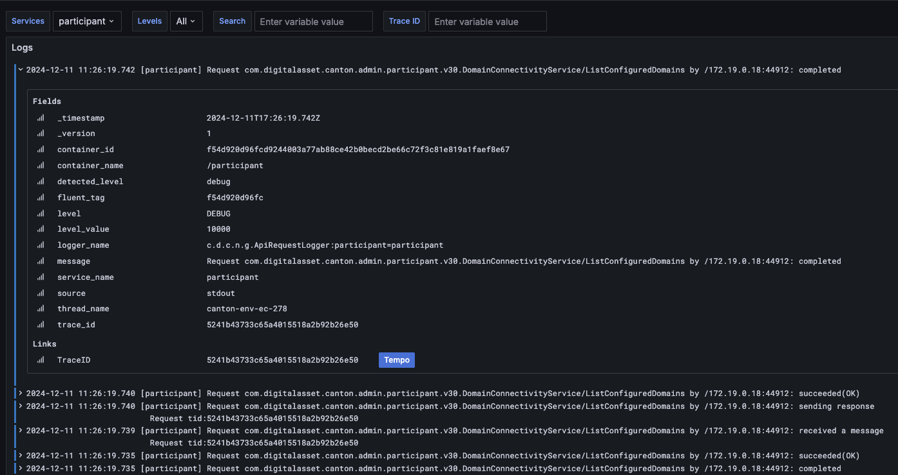
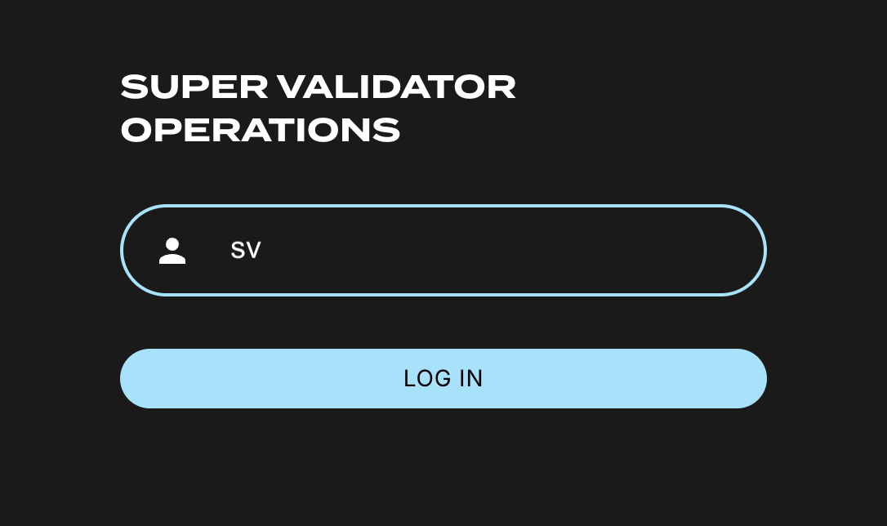

======================================================
Explore the Canton Network Application Quickstart demo
======================================================

**Contents**

`Exploring the demo <#exploring-the-demo>`__

`Prerequisites <#prerequisites>`__

`Walkthrough <#walkthrough>`__

   `Canton Console <#canton-console>`__

   `Daml Shell <#daml-shell>`__

   `Connect to DevNet <#connect-to-devnet>`__

   `Important: migration ID for DevNet connections <#important-migration-id-for-devnet-connections>`__

   `Configuring non-default DevNet sponsors <#configuring-non-default-devnet-sponsors>`__

   `SV UIs <#sv-uis>`__

   `Canton Coin Scan <#canton-coin-scan>`__

   `Observability dashboard <#observability-dashboard>`__

`Next Steps <#next-steps>`__

.. _exploring-the-demo:

Exploring the demo
==================

Explore the demo is intended to help you become familiar with a CN business operation within the CN App Quickstart.
The App Quickstart application is intended to be incrementally extended by your team to meet your business needs.
When you are familiar with the App Quickstart, review the technology choices and application design to determine what changes are needed.
Technology and design decisions are ultimately up to you.

.. wip::

As a result, the CN App Quickstart guides may be a little out of step with the application.
If you find errors or other inconsistencies, please contact your representative at Digital Asset.

This section works through a complete business operation within the CN App Quickstart.

Prerequisites
=============

You should have successfully `installed the CN App Quickstart <../download/cnqs-installation.html>`__
before beginning this demonstration.

Access to the `CN Docker repository <https://digitalasset.jfrog.io/ui/native/canton-network-docker>`__
is needed to successfully pull the Digital Asset artifacts from JFrog Artifactory.

If you need support accessing the JFrog Artifactory, please email support@digitalasset.com.

Access to the *Daml-VPN* connection or `a SV Node <https://docs.dev.sync.global/validator_operator/validator_onboarding.html>`__
that is whitelisted on the CN is required to connect to ``DevNet``.
The GSF publishes a `list of SV nodes <https://sync.global/sv-network/>`__ who have the ability to sponsor a Validator node.
To access ``DevNet``, contact your sponsoring SV agent for VPN connection information.

If you need support accessing the SV or VPN email support@digitalasset.com.

The CN App Quickstart is a Dockerized application and requires `Docker Desktop <https://www.docker.com/products/docker-desktop/>`__.
It is recommended to allocate 8 GB of memory and 3 GB of Swap memory to properly run the required Docker containers.
If you witness unhealthy containers, please consider allocating additional resources, if possible.

``DevNet`` is less intensive because the SVs and other ``LocalNet`` containers are hosted outside of your local machine.

Walkthrough
===========

After the App Quickstart is installed and running, confirm that you are in the quickstart subdirectory of the CN App Quickstart.

Open an incognito browser.

Navigate to:

localhost:3000/login

   💡 Currently, localhost URLs do not work in Safari. We are working on a solution and apologize for the inconvenience.

Alternatively, in the terminal, from quickstart/ run:

``make open-app-ui``

.. image:: images/01-login-cnqs.png
   :alt: CN App Quickstart Login screen

Make note that the ``AppProvider``’s username is “pat” and the password is “abc123” (all lowercase).

Login as the ``AppProvider``.

Fill in the login credentials: username: pat, password: abc123

.. image:: images/02-appprovider-signin.png
   :alt: AppProvider login screen

Select “AppInstalls” in the menu.

.. image:: images/02a-app-installs-view.png
   :alt: App Installs view

Open a terminal.

From ``/quickstart/`` run:

``make create-app-install-request``

This command creates an App Installation Request on behalf of the Participant.

.. note:: If your machine is not powerful enough to host ``LocalNet`` or if the docker containers are not responsive then the response may show a failure with status code 404 or 000 (as shown in the image below). Increasing Docker memory limit to at least 8 GB should allow the ``LocalNet`` containers to operate properly.

Return to the browser.

The install request appears in the list.

Click “Accept”.

.. image:: images/06-install-request.png
   :alt: install request

The ``AppInstallRequest`` is Accepted. The actions update to create or cancel the license.

.. image:: images/07-req-accept.png
   :alt: accept request

Click “Create License”.

The license is created and the “# Licenses” field is updated.

.. image:: images/08-create-lic.png
   :alt: create license

In the ``AppProvider``, “Pat the provider’s,” account, navigate to the **Licenses** menu and select “Actions.”

.. image:: images/09-licenses-view.png
   :alt: Licenses view

An “Actions for License” modal opens with an option to renew or expire the license.
Per the Daml contract, licenses are created in an expired state.
To activate the license, it must be renewed.

.. image:: images/10-license-modal.png
   :alt: License modal

To renew the license, enter a description then click the green “Issue Renewal Payment Request” button.

.. image:: images/11-issue-renewal.png
   :alt: issue renewal

The license renewal process is initiated and ultimately successful.

.. image:: images/12-init-renewal.png
   :alt: license renewal

The license is now available for a 30-day extension for a flat fee of $100 CC.

.. image:: images/13-license-available.png
   :alt: license available

Pat the provider has done as much as they are able until Alice pays the renewal fee.

   💡For the next step we recommend opening a separate browser in incognito mode.
   Each user should be logged into separate browsers for most consistent results.
   For example, if you logged into ``AppProvider`` using Chrome, you would use Firefox when logging into ``AppUser``.

Navigate to http://localhost:3000/login using a separate browser in incognito or private mode.

.. image:: images/01-login-cnqs.png
   :alt: login screen

Login as ``AppUser`` alice.

Note that ``AppUser``’s username is “alice” and the password is “abc123”.

.. image:: images/14-app-user-signin.png
   :alt: AppUser login screen

Go to the **Licenses** View and click the “Pay renewal” button.

.. image:: images/15-license-view.png
   :alt: License view

Click on the Pay Renewal button. This navigates to the Canton Coin Wallet log in. Click “LOG IN WITH OAUTH2”.

💡 If you have any issues with log in, navigate directly to http://wallet.localhost:2000/.

.. image:: images/16-cc-wallet-login.png
   :alt: CC Wallet login

This navigates to a keycloak login.

Enter the same username and password as before.

.. image:: images/17-keycloak-login.png
   :alt: alice login
   :width: 60%

Signing in directs to a preloaded Canton Coin Wallet.
Click **Send Payment**.

.. image:: images/18-canton-preloaded-wallet.png
   :alt: CC Wallet view

Return to the ``AppProvider``’s License Renewal Requests View.
The ``AppProvider`` may now Complete the Renewal.

.. image:: images/22-complete-renewal.png
   :alt: complete renewal

Clicking “Complete Renewal” results in a Success.

.. image:: images/23-renew-success.png
   :alt: renewal success

Alice’s License view shows the activated license.

.. image:: images/24-activated-license.png
   :alt: Activated license

Congratulations. You’ve successfully created and activated a license with a payment transfer!

Canton Console
--------------

The Canton Console connects to the running application ledger.
The console allows a developer to bypass the UI to interact with the CN in a more direct manner.
For example, in Canton Console you can connect to the Participant to see the location of the Participant and their synchronizer domain.

The app provider and the app user each have their own console.
To activate the app provider’s Canton Console in a terminal from the ``quickstart/`` directory.
Run:

``make console-app-provider``

Open the participant’s Canton Console with

``make console-app-user``

After the console initiates, run the ``participant`` and ``participant.domains`` commands, respectively.

``participant``

Returns their location in the ledger.

.. image:: images/25-console-participant.png
   :alt: Participant location in the ledger

``participant.domains``

Shows the Participant’s synchronizer.

.. image:: images/26-console-sync.png
   :alt: Participant synchronizer

``participant.health.ping(participant)``

Runs a health ping.
The ping makes a round trip through the CN blockchain.
Pinging yourself validates communication throughout the entire network.

.. image:: images/27-console-ping.png
   :alt: Ping yourself

Daml Shell
----------

The Daml Shell connects to the running PQS database of the application provider’s Participant.
In the Shell, the assets and their details are available in real time.

Run the shell from quickstart/ in the terminal with:

``make shell``

Run the following commands to see the data:

``active``

Shows unique identifiers and the asset count

.. image:: images/28-shell-ids.png
   :alt: Active identifiers

``active quickstart-licensing:Licensing.License:License``

List the license details.

``active quickstart-licensing:Licensing.License:LicenseRenewalRequest``

Displays license renewal request details.

``archives quickstart-licensing:Licensing.AppInstall:AppInstallRequest``

Shows any archived license(s).

Connect to DevNet
-----------------

Stop the ``LocalNet`` containers to change the connection from ``LocalNet`` to ``DevNet``.

In the terminal, run:

``make stop && make clean-all``

To edit the connection and observability parameters run:

``make setup``

When prompted to enable ``LocalNet``, enter “n”. This enables ``DevNet``

Optionally, enter “Y” to enable observability. This starts additional containers which may require more memory for Docker.

.. note:: Observability may no longer work while App Quickstart is under revisions. If you experience unexpected errors, set observability to "n". 

You may leave the party hint as the default value by tapping ‘return’ on the keyboard.

.. image:: images/31-party-hint.png
   :alt: Party hint

💡Running make setup regenerates ``.env.local`` but preserves the contents of the ``.env`` file settings.

The application is now connected to ``DevNet``.

Important: Migration ID for DevNet connections
~~~~~~~~~~~~~~~~~~~~~~~~~~~~~~~~~~~~~~~~~~~~~~

When connecting to ``DevNet``, verify that the ``MIGRATION_ID`` value in ``.env`` matches the current network migration ID for your ``DevNet`` Super Validator (SV).

Check the current migration ID at https://sync.global/sv-network/ under the GSF ``DevNet`` information section.

For example, if the SV Node Information shows the ``migration_id`` value as “0” then update ``MIGRATION_ID`` to “0” in your ``.env``.

.. note:: Some `env` vars will be in different files. For example, `/env/dev.env`

.. image:: images/32-gsf-sv.png
   :alt: GSF SV information

In ``.env``:

..

   ONBOARDING_SECRET_URL=https://sv.sv-1.dev.global.canton.network.digitalasset.com/api/sv/v0/devnet/onboard/validator/prepare

   MIGRATION_ID=0

   APP_PROVIDER_VALIDATOR_PARTICIPANT_ADDRESS=participant-app-provider

   APP_USER_VALIDATOR_PARTICIPANT_ADDRESS=participant-app-user

Configuring non-default DevNet sponsors
~~~~~~~~~~~~~~~~~~~~~~~~~~~~~~~~~~~~~~~

.. note:: Configuration files are currently under revision and may not be in the stated locations.

In ``DevNet`` mode, you can configure a non-default ``SPONSOR_SV_ADDRESS``, ``SCAN_ADDRESS`` and ``ONBOARDING_SECRET_URL`` or ``ONBOARDING_SECRET`` in the ``quickstart/.env`` file.

   💡 Connecting to ``DevNet`` requires a connection to an `approved SV <https://sync.global/docs/>`__.
   If your organization provides access to the DAML-VPN, then connect to it to access the Digital Asset-sponsored SV.

   Your organization may sponsor another `CN-approved SV <https://sync.global/sv-network/>`__.
   If this is the case, speak with your administrator for privileged access.

   Review the ``DevNet`` Global Synchronizer documentation to learn more about the `SV onboarding process <https://docs.dev.sync.global/validator_operator/validator_onboarding.html#onboarding-process-overview>`__.

   ⏱️ If you run into errors when making ``DevNet`` operations, double check that the ``DevNet`` VPN is active.
   ``DevNet`` VPNs may timeout, especially if left unattended for extended periods of time.

In an incognito browser navigate to ``localhost:3000/login``.
Login as the Org1 user and create and archive assets, as before.
Logout and do the same as the ``AppProvider``.

Canton Coin Scan
~~~~~~~~~~~~~~~~

While connected to ``DevNet``, navigate to the CC Scan Web UI at http://scan.localhost:4000/.

The default activity view shows the total CC balance and the Validator rewards.

Select the Network Info menu to view SV identification.

The Validators menu shows that the local validator has been registered with the SV.

.. image:: images/37-registered-validator.png
   :alt: Registered validator

Observability Dashboard
-----------------------

.. note:: Observability may no longer work while App Quickstart is under revisions.

In a web browser, navigate to http://localhost:3030/dashboards to view
the observability dashboards. Select “Quickstart - consolidated logs”.

The default view shows a running stream of all services.

Change the services filter from “All” to “participant” to view participant logs.
Select any log entry to view its details.

SV UIs
------

Navigate to http://sv.localhost:4000/ for the SV Web UI.
The SV view displays data directly from the validator in a GUI that is straightforward to navigate.

Login as ‘administrator’.

The UI shows information about the SV and lists the active SVs.

The Validator Onboarding menu allows for the creation of validator onboarding secrets.

Next steps
==========

You’ve completed a business operation in the CN App Quickstart and have been introduced to the basics of the Canton Console and Daml Shell.

Learn more about Daml Shell and the project structure in the Project Structure guide.
