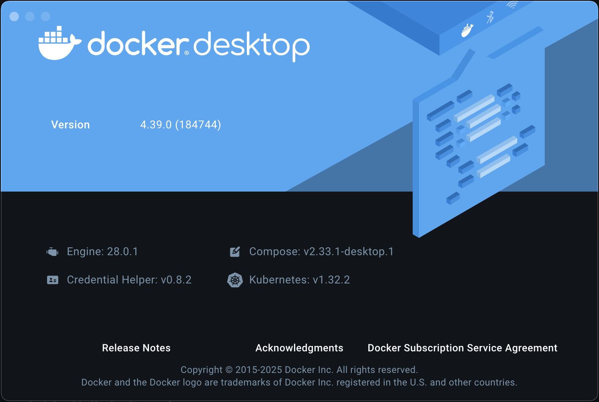

=================================
Canton Network App Quickstart FAQ
=================================

**Contents**

`CN App Quickstart Frequently Asked Questions <#cn-qs-frequently-asked-questions>`__

   `System requirements & setup <#system-requirements-setup>`__

   `Common issues & troubleshooting <#common-issues-troubleshooting>`__

   `Development & testing <#development-testing>`__

   `Infrastructure & environment <#infrastructure-environment>`__

   `Best practices & common
   pitfalls <#best-practices-common-pitfalls>`__

   `Database & query access <#database-query-access>`__

`CN App Quickstart Make target reference <#cn-qs-make-target-reference>`__

   `UI opening commands <#ui-opening-commands>`__

`LocalNet URLs <#localnet-urls>`__

**CN App Quickstart Frequently Asked Questions**
================================================

**System requirements & setup**
-------------------------------

**Have the best technologies been selected for the CN App Quickstart?**

The Quickstart is designed to help teams become familiar with Canton Network (CN) application development by providing scaffolding to kickstart development.
Quickstart is intended to be incrementally extended by you to meet your specific business needs.
Once you are familiar with the Quickstart, please review the technology choices and the application design to determine what changes are needed - technology and design decisions are ultimately up to you.
Please be aware that the Canton Network Application Quickstart (CN App Quickstart) is a rapidly evolving work in progress.

**What are the minimum system requirements to run CN App Quickstart LocalNet?**

The CN App Quickstart requires Docker Desktop with at least 8 GB of memory allocated to run ``LocalNet`` properly.
If your machine has less memory, consider declining Observability when prompted during setup.

**Which browsers are supported for running CN App Quickstart?**

Chromium browsers such as Chrome, Edge, and Firefox are recommended.
Safari has known issues with local URLs and should be avoided.
You may also use the same browser with one user in incognito mode and the other in standard mode.

**How should I test Participant and User interactions on LocalNet?**

For testing multiple users, use separate browsers or one browser in standard mode and another in incognito to avoid session/cookie interference.

**How do I handle authentication for JFrog Artifactory?**

You need to create a ``~/.netrc`` file with the following format:

::

   machine digitalasset.jfrog.io
   login <your-email>
   password <your-api-key>

Set permissions with ``chmod 600 ~/.netrc``

For more information see the Installation Guide.

**Why is Nix-shell unable to download my SSL certificate?**

The Nix prerequisite may introduce hurdles to installation if your enterprise runs behind a corporate proxy.
If nix-shell is not found, then verify that ``/nix/var/nix/profiles/default/etc/ssl/certs/ca-bundle.crt``
contains your corporate CA.

CN, PQS, Daml Shell and other CN App Quickstart related services run on a user-supplied JVM.
CN App Quickstart assumes that you have access to JVM v17+ with access to the internet.
If your organization operates behind a web proxy then JVM may not have automatic knowledge of the corporate certificate.
In these instances, JVM must be instructed to trust the certificate.

If Nix-related errors occur, verify that the correct certificates exist by looking at the log file.

::

   $ sudo HOME=/var/root
   NIX_SSL_CERT_FILE=/nix/var/nix/profiles/default/etc/ssl/certs/ca-bundle.crt
   /nix/store/dfqs9x0l0r4dn7zjp1hymmv9wvpp9x2k-nix-2.26.2/bin/nix-channel
   --update nixpkgs

If the log returns an error message such as:

::

   error: unable to download 'https://nixos.org/channels/nixpkgs-unstable':
   SSL peer certificate or SSH remote key was not OK (60)

Then the required corporate CA does not exist.
Request your corporate CA from your organization’s tech administrator and merge the certificate into the Nix ``certs ca-bundle.crt``.

If you need additional support, the `Nix reference manual <https://nix.dev/manual/nix/2.24/command-ref/conf-file.html#conf-ssl-cert-file>`__
offers guidance regarding the order at which cert files are detected and used on the host, as well as environment variables to override default file locations.

Graham Christensen’s Determinate Systems blog offers a solution for Nix
`corporate TLS certificates <https://determinate.systems/posts/zscaler-macos-and-nix-on-corporate-networks/>`__
problems on MacOS.
The NixOS team forked this solution as an `experimental installer <https://github.com/NixOS/experimental-nix-installer>`__
that is stable on most operating systems.

**Should I build with make or gradle?**

The gradle daemon has been disabled to prevent parallel processing of transcodegen.

Gradle tasks had been known to create order and concurrency issues which caused files to get cleaned too early.
Always prefer to use the make commands.

**What version of the Java SDK does the CN Quickstart use?**

The CN App Quickstart uses Java SDK version ``Eclipse Temurin JDK version 17.0.12+7``.
The Java SDK runs within the Docker container.

This information is specified in ``quickstart/compose.yaml`` and ``.env``, respectively.

``quickstart/compose.yaml``

::

   services:
   backend-service:
      image: "eclipse-temurin:${JAVA_VERSION}"

``.env``

::

   JAVA_VERSION=17.0.12_7-jdk

**How do I resolve a “build failed with an exception failure”?**

If ``make install-daml-sdk`` results in:

::

   Task :daml:unpackDamlSdk FAILED
   FAILURE: Build failed with an exception

Then you may have a corrupted ``daml-sdk snapshot``.
In most cases, deleting the identified tarball snapshot will resolve the issue in subsequent installation attempts.

This error may occur if ``make install-daml-sdk`` is interrupted.

A failure of this kind will end in:

::

   https://digitalasset.jfrog.io/artifactory/sdk-ee/3.2.0-snapshot.20241031.13398.0.vf95d2607/daml-sdk-3.2.0-snapshot.20241031.13398.0.vf95d2607-macos-x86_64-ee.tar.gz to /Users/USER/Code/cn-quickstart/quickstart/daml/.sdk/daml-sdk-3.2.0-snapshot.20241031.13398.0.vf95d2607-macos-x86_64-ee.tar.gz

   > Task :daml:unpackDamlSdk FAILED

   FAILURE: Build failed with an exception.

   \* What went wrong:

   Execution failed for task ':daml:unpackDamlSdk'.

   > java.io.EOFException

To resolve this error, copy the faulty ``.tar.gz`` file with directory path as shown in *your* terminal and ``rm`` it:

::

   rm /Users/USER/Code/cn-quickstart/quickstart/daml/.sdk/daml-sdk-3.2.0-snapshot.20241031.13398.0.vf95d2607-macos-x86_64-ee.tar.gz

.. note:: ``USER`` in ``/Users/USER/`` will display your username. Copy and paste from your terminal. NOT this FAQ.

Reattempt make ``install-daml-sdk``.

**How do I resolve Docker containers that fail unexpectedly?**

Starting the CN App Quickstart while running Docker Desktop version 4.38.0 may result in java.lang.NullPointerException errors:

::

   2025-01-31 15:12:55,705 ERROR [41 lity] FixedSizeBlockingPool [] Pool object could not be added due to exception:
   java.lang.NullPointerException: Cannot invoke
   "jdk.internal.platform.CgroupInfo.getMountPoint()" because "anyController" is null [ ] Exception in thread "Native-Process-Pool-1-17"

This error indicates that ORDS containers (an Oracle web client in Java) cannot properly load during startup.

First, verify that you are not running Docker Desktop version 4.38.0 (181591).

To view the version number, open Docker Desktop. In the top menu, select **Docker Desktop -> About**.

If you are running Version 4.38.0 then upgrade Docker Desktop and make a new attempt.

If you’d like to learn more about this issue, visit `JDK Bug System <https://bugs.openjdk.org/browse/JDK-8348566>`__.

**Common issues & troubleshooting**
-----------------------------------

**How can I check if my CN App Quickstart deployment is running correctly?**

Use ``make status`` to see all running containers and their health status.

**What should I do if containers show as "unhealthy" after startup?**

The most common cause is insufficient memory allocation to Docker. Try:

1. Increase Docker memory allocation to at least 8 GB

2. Run ``make stop; make clean-all; make clean-docker``

3. Run ``make setup`` and turn off ``observability``

4. Restart with ``make start``

**How can I monitor system metrics?**

You can use Grafana at http://localhost:3030/ to monitor system metrics if ``observability`` is enabled.

For more information see the Observability and Troubleshooting Overview.

**What should I do if I need to completely reset my environment?**

Execute the following commands in order:

1. ``make stop``

2. ``make clean-all``

3. ``make setup`` (to reconfigure environment options)

4. ``make start``

**How do I resolve "Couldn't find env file" in make build?**

If you receive an error message such as:

::

   Couldn't find env file: /Users/USER/development/canton/cn-quickstart/quickstart/.env.local
   make: \**\* [build-docker-images] Error 15

Run ``make setup`` to create the ``.env.local`` file.

**Development & testing**
-------------------------

**How do I access the Daml Shell for debugging?**

Run ``make shell`` from the quickstart directory.
This provides access to useful commands like:

-  ``active`` - shows summary of contracts

-  ``active quickstart:Main:Asset`` - shows Asset contract details

-  ``contract [contract-id]`` - shows full contract details

**How can I monitor application logs and traces?**

The CN App Quickstart provides several observability options:

1. Direct container logs: ``docker logs <container-name>``

2. Grafana dashboards: http://localhost:3030/

3. Consolidated logs view in Grafana

**Infrastructure & environment**
--------------------------------

**What's the difference between LocalNet and DevNet deployment?**

``LocalNet`` runs everything locally including a Super Validator and Canton Coin wallet, making it more resource intensive but self-contained.

``DevNet`` is NOT included in the CN App Quickstart.
However, CN ``DevNet`` connects to actual decentralized Global Synchronizer infrastructure operated by Super Validators and requires whitelisted VPN access and connectivity.

For more information see the Project Structure Overview.

**What is ScratchNet?**

``ScratchNet`` is a persistent Canton Network environment that supports team collaboration while maintaining centralized control.
It fills the gap between a single-developer LocalNet (constrained by one laptop's resources) and a fully decentralized DevNet (maintained by Super Validators).
Development teams typically deploy ``ScratchNet`` on a shared server to enable longer-running instances with persistent data storage across development sessions.

**How can I find out the migration_id of DevNet?**

Go to https://sync.global/sv-network/ and look for the ``migration_id`` value.

**Do I need VPN access to use CN App Quickstart?**

No. VPN access is only required for ``DevNet`` connections.
The CN App Quickstart only provides a ``LocalNet`` deployment option, which does not require VPN access.

**What will I need when I am ready to connect to DevNet?**

To connect to CN ``DevNet`` you need access to a SV Node that is whitelisted on the CN. 
Contact your sponsoring Super Validator agent for connection information.

**How do I log in with Keycloak?**

The CN App Quickstart uses Keycloak for authentication when ``OAUTH2`` is enabled.
If you have issues with logging in with Keycloak credentials, you may begin troubleshooting by running make status to verify the Keycloak service is running.

Keycloak should show healthy.

::

   keycloak   quay.io/keycloak/keycloak:26.1.0 "/opt/keycloak/bin/k…"
   keycloak   17 minutes ago Up 17 minutes (healthy) 8080/tcp, 8443/tcp, 9000/tcp

Keycloak credentials are set in ``oauth2.env`` with the following credentials:

::

   Username: AUTH_APP_USER_WALLET_ADMIN_USER_NAME (e.g. app-user)
   Password: AUTH_APP_USER_WALLET_ADMIN_USER_PASSWORD (e.g. abc123)

The Keycloak user must have the same ID as the ledger user’s ID.
This should be reflected in the default behavior.

**Best practices & common pitfalls**
------------------------------------

**How should I handle multiple user testing in the local environment?**

Best practices include:

1. Use separate browsers for different users

2. Follow proper logout procedures between user switches

3. Be aware that even incognito mode in the same browser may have session interference

4. Consider using the make commands for testing specific operations (e.g., ``make create-app-install-request``)

**Database & query access**
---------------------------

**What's the recommended way to query ledger data?**

The Participant Query Store (PQS) is recommended for querying ledger data.

**CN App Quickstart Make target reference**
===========================================

+---------------------+------------------------------------------------+
| **Target**          | **Description**                                |
+=====================+================================================+
| build               | Build frontend, backend, Daml model and docker |
|                     | images                                         |
+---------------------+------------------------------------------------+
| build-frontend      | Build the frontend application                 |
+---------------------+------------------------------------------------+
| build-backend       | Build the backend service                      |
+---------------------+------------------------------------------------+
| build-daml          | Build the Daml model                           |
+---------------------+------------------------------------------------+
| create-             | Submit an App Install Request from the App     |
| app-install-request | User participant node                          |
+---------------------+------------------------------------------------+
| restart-backend     | Build and restart the backend service          |
+---------------------+------------------------------------------------+
| restart-frontend    | Build and restart the frontend application     |
+---------------------+------------------------------------------------+
| start               | Start the application and observability        |
|                     | services if enabled                            |
+---------------------+------------------------------------------------+
| stop                | Stop the application and observability         |
|                     | services                                       |
+---------------------+------------------------------------------------+
| stop-application    | Stop only the application, leaving             |
|                     | observability services running                 |
+---------------------+------------------------------------------------+
| restart             | Restart the entire application                 |
+---------------------+------------------------------------------------+
| status              | Show status of Docker containers               |
+---------------------+------------------------------------------------+
| logs                | Show logs of Docker containers                 |
+---------------------+------------------------------------------------+
| tail                | Tail logs of Docker containers                 |
+---------------------+------------------------------------------------+
| setup               | Configure local development environment        |
+---------------------+------------------------------------------------+
| canton-console      | Start the Canton console.                      |
+---------------------+------------------------------------------------+
| clean-canton-       | Stop and remove the Canton console container   |
| console             |                                                |
+---------------------+------------------------------------------------+
| shell               | Start Daml Shell                               |
+---------------------+------------------------------------------------+
| clean-shell         | Stop and remove the Daml Shell container       |
+---------------------+------------------------------------------------+
| clean               | Clean the build artifacts                      |
+---------------------+------------------------------------------------+
| clean-docker        | Stop and remove application Docker containers  |
|                     | and volumes                                    |
+---------------------+------------------------------------------------+
| clean-application   | Like clean-docker, but leave observability     |
|                     | services running                               |
+---------------------+------------------------------------------------+
| clean-all           | Stop and remove all build artifacts, Docker    |
|                     | containers and volumes                         |
+---------------------+------------------------------------------------+
| install-daml-sdk    | Install the Daml SDK                           |
+---------------------+------------------------------------------------+
| generate-NOTICES    | Generate the NOTICES.txt file                  |
+---------------------+------------------------------------------------+
| update-env-         | Helper to update DAML_RUNTIME_VERSION in .env  |
| sdk-runtime-version | based on daml/daml.yaml sdk-version            |
+---------------------+------------------------------------------------+

**UI Opening Commands**
-----------------------

+------------------+---------------------------------------------------+
| **Target**       | **Description**                                   |
+==================+===================================================+
| open-app-ui      | Open the Application UI in the active browser     |
+------------------+---------------------------------------------------+
| open-observe     | Open the Grafana UI in the active browser         |
+------------------+---------------------------------------------------+
| open-sv-wallet   | Open the Super Validator wallet UI in the active  |
|                  | browser                                           |
+------------------+---------------------------------------------------+
| o                | Open the Super Validator interface UI in the      |
| pen-sv-interface | active browser                                    |
+------------------+---------------------------------------------------+
| open-sv-scan     | Open the Super Validator Scan UI in the active    |
|                  | browser                                           |
+------------------+---------------------------------------------------+
| open             | Open the App User wallet UI in the active browser |
| -app-user-wallet |                                                   |
+------------------+---------------------------------------------------+

**LocalNet URLs**
=================

+-------------------------------+--------------------------------------+
| **URL**                       | **Description**                      |
+===============================+======================================+
| http://localhost:3000         | Main application UI                  |
+-------------------------------+--------------------------------------+
| http://localhost:3030         | Grafana observability dashboard (if  |
|                               | enabled)                             |
+-------------------------------+--------------------------------------+
| http://localhost:4000         | Super Validator gateway - lists      |
|                               | available web UI options             |
+-------------------------------+--------------------------------------+
| http://wallet.localhost:2000  | Canton Coin wallet interface         |
+-------------------------------+--------------------------------------+
| http://sv.localhost:4000      | Super Validator Operations           |
+-------------------------------+--------------------------------------+
| http://scan.localhost:4000    | Canton Coin Scan web UI - shows      |
|                               | balances and validator rewards       |
+-------------------------------+--------------------------------------+
| http://localhost:7575         | Ledger API service                   |
+-------------------------------+--------------------------------------+
| http://localhost:5003         | Validator API service                |
+-------------------------------+--------------------------------------+

Sponsoring Super Validators may offer different URLs for their ``DevNet`` services.
